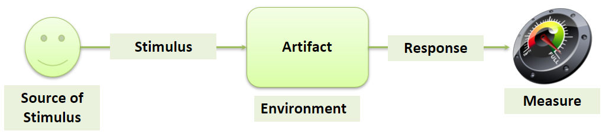
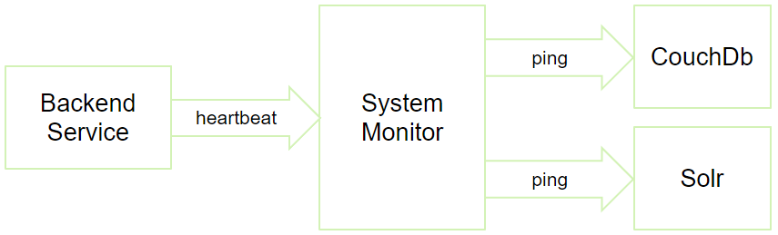

Software Architectures
===

### Table of Contents

- **SW architecture**
- **IEEE 1471 - Conceptual Framework**
  - recognizes
    - **System**
    - **Mission**
    - **Environment**
    - **Stakeholder**
    - **Concern**
    - **Architecture**
- **Architectural description (AD)**
  - consists of **Views**
    - based on **Viewpoints (VP)**
    - written down as **Models**
- some **Models** are
  - **Bass, Clemens & Kazman**
    - which defines
      - **Module VP**
        - consisting of (**static**) **Modules**
        - further sub-typed into
          - **Decomposition module VP** which shows **part of** relations
          - **Usage VP** which shows **uses** relations
          - **Class VP** which shows **is a** relations
      - **Component and Connector VP (C&C VP)**
        - consisting of (**runtime**) **Components** and **Connectors** between them
      - **Allocation VP**
        - consisting of **Modules**, **C&C** and **real world entities**
        - further sub-typed into
          - **Deployment VP** which connects **C&C** to **hardware**
          - **Implementation VP** which connects **Modules** to **files**
          - **Assignment VP** which connects **Modules** to **people**

### Software architecture

- is an abstraction, a way to deal with complex systems in an orderly manner
- a set of architectural software structures, relations between them and properties of both structures and relations
- 3 types of architectural structures are:
  1. Modules
    - **"parts of the system"**
    - each module has some computational responsibilities
    - module offers some functionality (either to the user or other modules)
    - by modularizing the system, modules can then be assigned to programming teams to be actually implemented, tested and integrated
    - they are **static structures** (as opposed to for example "modes" which can change dynamically during runtime)
  2. Components
    - **"parts of the system in runtime"**
    - structures which focus on how software elements interact with each other in runtime
    - they are made up of compiled programs from various modules
  3. Allocations
    - **"how modules and components are split to environment"**
    - they can be **organizational**, **developmental** (which teams work on which modules...), **installational** (where and how to install individual parts of the system's software...), and **executional** (how to start the software, what's the workflow...).

### IEEE 1471 - Conceptual Framework

- a standard for software architecture terminology
- it takes into account all sizes and natures of SW systems.
  - **System**
    - the central component of a software system (obviously)
  - **Mission** 
    - the goals the system aims to accomplish (create an easy-to-use social network, enable users to post pictures, like them and comment on them...)
  - **Environment** 
    - real-life entities connected to the system in any way (organization, legislations, customers, partners...)
    - it both affects the system (system needs to conform to laws, customers need to be satisfied...), and is affected by the system itself (if some parts of the system are automated, workers in that department are no longer needed...)
  - **Stakeholder**
    - Individuals and/or groups which have some intrest in the system (users, managers, admins, owners, service providers, testers, designers...)
    - these influence many aspects of the system (affordability, ease of use, security...)
    - often these intrests are in conflict with one another (affordability vs. pretty much anything else)
  - **Concern**
    - Requirements and wishes of the stakeholders as well as constraints created by the environment (laws, hardware limits)
    - they affect key characteristics of the system (usability, testability, reliability, security, performance...)
  - **Architecture**
    - should be documented in the form of **Architectural description**
    - it identifies stakeholders, their concerns, environment and its restrictions
    - it tries to address these by shaping the system
- more [here](http://web.mit.edu/richh/www/writings/ieee1471-and-SysEng-%28draft%29.pdf)

### Architectural description (AD)
- it is **complete** iff it addresses all **identified** concerns of the software system (as it's fairly hard to address non-identified ones)
- it is organized into **multiple architectural views**

### View

- **"represents the architecture from the perspective of a related set of concerns"**
- it is a part of **AD**
- it reduces complexity and makes the architecture manageable
- each view is relative to an **architectural viewpoint**
- each view consists of one or multiple **models**
- more [here](https://en.wikipedia.org/wiki/View_model)

### Viewpoint

- **captures the rules for constructing and analyzing a particular kind of view**
- it is a template for a view which can be reused in views across different system ADs
- e.g., when one looks at the front of a car and front of a chair, they see different things - views. The viewpoint itself however - looking from the front - stays the same

### Model

- **"represents system or its part (often graphically) in form relevant to its view"**
- the model also includes its "definition" - what elements and relationships it uses, how it represents them, etc.

### Bass, Clemens & Kazman model

- 3 types of viewpoints:
  - **Module viewpoint**
    - "How is the system structured as a set of code units?"
    - aimed at stakeholders with concerns about **system's complexity** (development planning, testing, reusability...)
    - its elements are **modules** 
      - static implementation units with (logically related) set of responsibilities 
      - e.g., class, interface, package, service or collection of services
      - each **includes metadata** e.g., its name, textual specification, creation date, people responsible
    - its relations are **static relationships** between them 
      - e.g., is part of, depends on, uses
    - this viewpoint answers questions such as
      - what are module's dependencies
      - which other modules use it
      - what is the functional responsibility of a module
    - it is important
      - as a basis for actual implementation of the system and its individual modules
      - for the development organization
      - for resolving significant changes during and after development
      - for response to new and/or changing user requirements
      - as a roadmap for new developers in team or when communicating with customer
    - can be further divided into
      - **Decomposition module viewpoint**
        - modules are recursively split into smaller components until they reach size that is easy to understand as a whole
        - it is a **part-of** relationship
        - some parts are omitted (such as interface specification, internal code, test plans), which is called **information hiding**
        - it is used for divide-and-conquer development approach, to analyze dependencies and connect smaller parts to bigger ones
        
      - **Usage viewpoint**
        - shows dependencies between modules in form of **uses**, etc.
        - it is used to track dependencies and see impact of changes of a specific module (e.g., which other modules need to be changed as well)
        
      - **Class viewpoint**
        - it is a **is a** kind of relationship
        - shows which modules are **sub-classes/specializations** of other modules (in the logical sense, not strict as in OOP)
        - it is used in terms of module reusability, incremental addition of functionality
        
  - **Component-connector viewpoint**
  
    - "How is the system structured as a set of elements which have runtime behavior and interactions?"
    - aimed at stakeholders with concerns about **runtime properties** (availability, performance ...)
    - although components are similar to modules, it is not 1:1 mapping (e.g., component can consist of multiple modules working together, and a module can be instantiated multiple times into multiple components)
    - elements are divided between:
      - **Components**
        - principal components
        - represent the **runtime behaviour** of the system
        - e.g., services, clients, peers, processes, threads, objects, data stores...
      - **Connectors**
        - represent interactions between components
        - e.g., method calls from another component, sending a message (REST, HTTP)
    - it shows how the system behaves in run-time, which parts ran and/or can run in parallel, what's the data flow within system, how system changes affect the runtime, how a failed component affects the availability and stability of the whole system...
    - it can show how system works in time using UML sequence diagrams
    
  - **Allocation viewpoint**
    - "How is the system related to non-software structures in the environment?"
    - aimed at stakeholders with concerns about **hardware and manpower infrastructure** (administration, maintenance, hardware requirements...)
    - shows how module and C&C viewpoints connect to the real world
    - there are 3 main sub-types:
      - **Deployment viewpoint**
      
        - connects runtime **components** and **connectors** with **hardware** elements
        - shows how the system is actually deployed in real life on hardware
      - **Implementation viewpoint**
      
        - connects static **modules** with **file structures**
        - shows where specific modules and their parts are structured in the file system
      - **Assignment viewpoint**
      
        - connects static **modules** with **people**
        - shows who is responsible for individual modules

### AD documentation template

- **Section 1: Documentation roadmap**
  - table of contents, showing user where to look
- **Section 2: System overview**
  - high-level brief description of the system, its functions, stakeholders, requirements, environment, goals...
- **Section 3: Views**
  - **Section 3.1: Documentation documentation**
    - how are views documented
  - **Section 3.2+: Specific view documentation**
    - **Section 3.2+.1: Representation**
      - one or more (graphical) representations
      - contains all the important elements and relationships
    - **Section 3.2+.2: Catalog**
      - lists elements, relationships and describes all their additional relevant data

### 4+1 Views Model

- consists of 4 viewpoints + 1 used for scenarios
  - **Logical viewpoint**
    - similar to **Module viewpoint**
    - decomposes system into **functional modules or services**, plus their important attributes and provided methods.
    - these are then decomposed into even smaller units, etc.
    - recommended UML state machine diagrams
  - **Behaviour viewpoint**
    - similar to **C&C viewpoint**, but simpler
    - decomposes sytem in runtime into **processes**, which are sequences of tasks performed by functional units from the logical viewpoint.
    - recommended UML sequence and activity diagrams
  - **Development viewpoint**
    - similar to **decomposition** and **usage viewpoints**
    - decomposes system to **software elements** which need to be developed and tested
    - describes elements' interfaces and usage between them
    - recommended UML deployment diagrams
  - **Physical viewpoint**
    - maps logical and behaviour viewpoints to **physical hardware and network configurations**
    - recommended UML deployment diagram
  - **Application scenarios**
    - describes use-cases
    - explains architecture from the functional point of view
    - demonstrates role of each module in a use case

### Requirements

- placed by stakeholders and environment
- they shape the system and its architecture
- can be:
  - **Functional requirements**
    - describe features and functionality of the system
    - most important to users
    - fulfilled by the design of the system itself
  - **Quality requirements**
    - focus on system's qualities such as **security, availability, robustness, reliability**...
    - e.g., how many requests can system handle in tandem, how easy it is to configure it, how easy testing is...
    - often not requested by user, just implied
    - fulfilled by the design or focusing on the qualities within the design (architecture often doesn't change)
  - **Constraints**
    - describes facts "from the outside"
    - e.g., laws, gravity, physics...
    - specifically **System constraints**
      - e.g., legacy third-party software the system needs to be able to use
    - fulfilled by designing the system "using" the contraints (as they are in a way architectural decisions that cannot be changed)
    - they often affect other requirements (e.g., lack of budget and time lower quality and cut off functionality)
- almost never can all requirements be fully met, they have to be prioritized and some be left out or implemented only partially

### Quality Attributes

- a measurable or testable property of a system that is used to indicate how well the system satisfies a quality requirement of a stakeholder
- can be split into
  - **System QA**
    - also called **"hard"** QA, as they are the most improtant from the view of SW architects
    - can be further split into
      - **Run-time QA**
        - "how well the system behaves in run-time"
        - e.g., **availability, perfromance, security, usability**
      - **Design-time QA**
        - e.g., **modifiablity, portability, testability, reusabilit, integrability**
  - **Bussiness QA**
    - also called **"soft"** QA, not related to the quality of the system, but how well it fits into the environment
  - **Architectural QA**
    - also called **"meta"** QA
    - related to quality of architectural design and documentation
    - more important to SW architects and dev team than users and customers
    - can be for example
      - **correctness**
        - no mistakes or contradictions in the AD
      - **completeness**
        - that AD covers all requirements
      - **buildability**
        - that system can be finished in the desired time and budget
      - **conceptual integrity**
        - that the whole architecure meets some standards/theme

### System QA in detail

  - **Availability QA**
    - "how well can system handle problems"
    - computed as $\frac{\textrm{mean time to failure}}{\textrm{mean time to failure} + \textrm{mean time to repair}}$
    - **failure** occurs when system no longer delivers a service that is consisten with its specification and which is **observable** by users or other systems
    - on the other hand, a **fault** is **not observable** and is **not an availability** issue, but it can lead to a failure
    - techniques to improve it are:
      - **Fault recovery**
        - stop faults from becoming failures
      - **Fault repair**
        - stop faults from happening in first place
    - parts of the scenario are:
      - **Source** is the **observer**, either 
        - **Internal** 
          - observed by other component
          - it's still a fault, system reacts to fault
        - **External** 
          - observed by user or other system
          - already observed, system reacts to failure
      - **Artifact** is the **failed component** (the one where failure is observed, not necessarily one which caused the initial fault)
      - **Stimulus** is the **observation** of a fault, can be:
         - **Omission** - component doesn't respond
         - **Crash** - component repeatedly doesn't respond
         - **Incorrect timing** - component responds either early or late
         - **Incorrect response** - component responds in time but incorrectly (corrupted data, wrong format...)
      - **Environment** are the **conditions of the artifact** and its **surrounding environment** under which the fault and its observation is considered
        - startup/shutdown
        - normal/overloaded operation
        - first/repeated fault
      - **Response** is the **reaction** of the system, masking or recovering, optionally logging, notificating, disabling the artifact...
      - **Measure** is either
        - probability of scenario occuring
        - time required to detect and repair
        - time the system or artifact is hindered
    - **tactics** for improving availability are:
      - **Fault detection**
        - **Ping** - hierarchical echo, testing reachability and delay
        - **Heartbeat** - periodic echo requesting response with health data of other component
        - can be moved to separate component called **Monitor**, which checks health of other components and hardware
        
        - **Timestamps** - echos containing timestamps, can detect timing and response faults, especially important in distributed systems, e.g., Lamport timestamps
        - **Timeout** - simpler than timestamps, detects timing faults on top of omissions and crashes.
        - **Voting (N-modular redundancy)**
          - detects incorrect responses by voting responses of N components
          - can have strategies:
            - **Replication** - e.g., thermometers
            - **Functional** - same inteface, different implementation (e.g., multiple algorithms)
            - **Analytic** - completely different components (e.g., altitude calculated using barometric pressure, radar altimeter, GPS), requires sophisticated voter
      - **Fault recovery**
        - **Preparation and repair tactics**
          - try to recover artifacts
          - can be:
            - **Redundancy**
              - backup copies of components needing to be available
              - can be:
                - **Active / hot spare** - backup components perform the same ops in tandem, take over when active fails - no delay
                - **Stand-by / warm spare** - backup components are updated by the active component, when it fails, one takes over from the last update - slight delay
                - **Passive / cold spare** - backup components are off, once active fails, another is turned on and starts computation from the beginning - biggest delay
            - **Rollback**
              - create checkpoints (at regular times or after important processes)
              - component reverts upon reaching an invalid state
              - often expensive, impossible in distributed systems
            - **Saga**
              - "rollback for distributed systems"
              - processes are connected to transactions which are reverted as a whole (analogic to database transactions)
            - **Retry**
              - assumes fault will not reappear upon retrying
              - used in networks where faults are common and often caused by temporary sources
            - **Ignore**
              - e.g., DoS counter-measure
            - **Degradation**
              - shut down non-critical system functions upon fault, maintain critical parts
        - **Reintroduction tactics**
          - try to recover failed component
          - can be:
            - **Shadow**
              - operate failed one in "shadow mode" for a predefined amount of time, where it changes its behaviour (e.g., use cached data if external source if unavailable)
            - **State resynchronization**
              - backup components are synced with active one, when out of sync, they're resynced
            - **Escalated restart**
              - component's unprotected memory is freed or all memory is freed or whole system is restarted
        - **Fault prevention tactics**
          - can be:
            - **Removal of service**
              - preventive restart or reconfig of a component to scrub latent faults, e.g., memory leaks
            - **Transactions**
              - ops in system are executed in transactions with ACID properties (e.g., 2PC protocol)
            - **Predictive model**
              - monitor records outputs of components and tries to evaluate their health
    - can be tested using **Chaos engineering** (chaos monkeys), which randomly turn off parts of dist. systems, trying if system can recover
  - **Modifiability QA**
    - "how easily a system can be extended, parts removed or changed"
    - can depend on
      - how well is separation of concerns implemented (coupling)
      - coding techniques (badly maintained / undocumented code)
    - parts of the scenario are:
      - **Source** is the **actor** making the modification
      - **Artifact** is a **module/component** which needs to be changed
      - **Stimulus** is the **change** being made
      - **Environment** is **when** the change is made (**runtime/design time**)
      - **Response** is **making, testing and deploying** the change
      - **Measure** are **time and money** necessary for the change, or number of artifacts, new technical debt...
    - important concepts which affect modifiability are:
      - **Module coupling**
        - how modules overlap in responsibilities
        - can be:
          - **tight** meaning high probability of modification affecting other module
          - **loose** meaning the opposite
        - based on dependencies:
          - **Data dep.** - A passes data to B, therefore B is dependent of A's formatting
          - **Control dep.** - A controls B in terms of the flow of messages
          - **Content dep.** - A depends on B's internal functionality (e.g., validating incoming data)
          - **Quality/QoS dep.** - B expects certain quality of data from A
          - **Existence dep.** - B relies on existence of A.
      - **Module cohesion**
        - how responsibilities of a module belong together
        - can be **high** and **low**
        - can be of types:
          - **Coincidental** - arbitrary
          - **Logical** - e.g., all functions validate data
          - **Temporal** - related in time, e.g., module with processes which happen at the same time
          - **Procedural** - responsibilities happen in sequence (temporal cohesion but procedures are related)
          - **Informational** - reponsibilities work on the same data
          - **Sequential** - responsibilities create a pipeline (output of one is input of another)
          - **Functional** - responsibilities are related by a single well-defined task
    - **loose coupling** + **high cohesion** => **high modifiability**
    - **tactics** for improving modifiability are:
      - **Decomposition (cohesion-focused)**
        - moving responsibilities between modules
        - splitting low-cohesion modules to submodules
        - can be:
          - **Semantic**
            - tries to achieve **functional cohesion**
            - split unrelated responsibilities in submodules or move to other modules
          - **Based on anticipated changes**
            - tries to anticipate changes via modifiability scenarios
            - separate responsibilities prone to change to "protect" others
          - **Based on shared responsibilities**
            - tries to find shared responsibility in multiple modules and separating it in its own module
      - **Coupling-focused**
        - tries to prevent ripple effect (modification cascading due to dependencies)
        - can be:
          - **Dependencies restriction**
            - try to minimize number of modules some module is dependent on
            - e.g., by layered architecture (module depends only on those in higher level)
          - **Information hiding / encapsulation**
            - introducing explicit interfaces to separate modules
          - **Intermediary translator**
            - new module responsible for translation of messages or calls between modules
            - can be:
              - **Anticorruption layer**
                - creates **anti-corruption layer** - module's internal logic doesn't have to be corrupted (conform) to the other module's logic
              - **Service layer / open host**
                - translator layer built around an unstable module to keep other modules from being corrupted
              - **Message broker**
                - used for highly dependent subsystem
                - all modules instead communicate with broker, which translates and forwards messages further
          - **Preservation**
            - use **versioning** for **backwards compatibility**, leave old interfaces and mark as **deprecated**
          - **Refactoring**
            - lowering technical debt by manually reworking the modules
          - **Defer binding**
            - try to design in such a way that changes can be done "by computers"
            - e.g., use GUI designer apps, scripts for building software like Makefile, automated deployment, use of DLLs, etc.
  - **Performance QA**
    - "how long does it take for system to respond to requests"
    - can depend on
      - amount of communication between components (serialization/deserialization)
      - amount of functionality in individual components (bottleneck)
      - where components are allocated (weak hardware)
      - implemented algorithms (bad time complexity)
    - parts of the scenario are:
      - **Source** can be
        - **Internal** - another component of the system
        - **External** - user, another system or the passage of time
      - **Artifact** is the whole **system** or some of its runtime **components**
      - **Stimulus** is a **request stream** which must be satisfied in a **specified time**. which can be
        - **Periodic** - arrive predictably at regular time intervals
        - **Stochastic** - arrive according to some probability distribution
        - **Sporadic** - arrive unpredictably
      - **Environment** is the **operation mode** when the event occurs, e.g., normal mode, emergency mode, at peak or overloaded
      - **Response** is that the **system processes** the requests
      - **Measure** can be
        - **Latency** - time between request and response
        - **Jitter** - variation of latency
        - **Miss rate** - ratio of request not processed
      - **Tactics** to improve performance are:
        - **Control resource demand**
          - try to minimize demand on available resources
          - can be:
            - **Manage sampling rate**
              - e.g., reduce sampling frequency in a monitoring system
              - can result in fidelitty loss
            - **Limit event response**
              - incoming requests are queued and sequentially processed
              - if queue is filled, new requests can either be dropped (becomes availability problem) or treated in some way (e.g., setting environment to overloaded)
            - **Prioritization**
              - variation of limitting event response, full queue is filtered based on some definition of priority
            - **Bound execution times**
              - requests of which computations exceed some timeout are dropped and execution stopped
            - **Improve algorithms**
              - try to decrease latency by improving critical areas
            - **Improve architecture**
              - e.g.
                - use binary formats (speed up serialization/deserialization) 
                - reduce number of requests (improve API)
                - remove intermediary components (may worsen modifiability)
                - component co-location (move components on the same hardware or close by)
                - edge computing 
        - **Manage resources**
          - try to improve effectiveness of available resources
          - can be:
            - **Increase resources**
              - ***Harder, better, faster, stronger***
              - also not doing dumb stuff (like not using GPU for some computation)
            - **Concurrency**
              - processing different streams of events on different threads
              - introduce scheduling policies to maximize either fairness, throughput or other goals
            - **Replicas**
              - create replicas of bottleneck components and use load balancer to distribute incoming traffic
            - **Caching**
              - keeping frequently accessed data in closer memory to avoid repetituous reading or requesting data
  - **Scalability QA**
    - ability of software system to handle tasks as it grows in size (its userbase, requests per time, amount of data managed...)
    - nowadays, scalability also considers availability, performance and modifiability change
    - parts of the scenario are:
      - **Source** is the **reason** for growth (userbase which grows, other system which increases request throughput, stakeholders which require growth)
      - **Artifact** is the **module** or **component** which needs o scale
      - **Stimulus** is the **aspect** which grows
      - **Environment** is **when** it scaling happens (runtime, build time, initiation time, design time)
      - **Response** is the **fact** that artifact is scaled
      - **Measure** specifies **how** to show scenario is fulfilled (ensure that modifiability, performance, avaiability are satisfied, plus time it takes to scale)
    - **Tactics** to improve scalability are on so-called **scale cube**:
      - **X-axis**
        - **increasing instances** of components behind **load balancer**
        - works for availability and performance
      - **Y-axis (functional decomposition)**
        - tries to split application to a set of loosely-coupled components separated into **microservices**
        - it is close to modifiability tactics
      - **Z-axis**
        - **increasing instances** of components which work on **partitions** of the overall data behind a **router**
  - **Security QA**
    - ability of a system to protect data and information from unauthorized access while still providing access to people and system that are authorized
    - unauthorized attempt is called an **attack**
    - securita **goals** are:
      - **Confidentiality**
        - data or services are protected from unauthorized access
      - **Integrity**
        - data or services are not subject to unauthorized manipulation
      - **Availability**
        - system will be available for legitimate use
      - **Authentication**
        - system can verify identity of party in a transaction
      - **Non-repudiation**
        - system can guarantee that the sender of a message cannot later deny having sent the message, and that the recipient cannot deny having received the message
      - **Authorization**
        - system can grant user their privileges to perform a task
    - parts of the scenario are:
      - **Source** is an **attacker** (human or other system)
      - **Artifact** is a system **service**, runtime **component**, system **resource**, **data** within, produced or consumed by the system
      - **Stimulus** is the **attack**
      - **Environment** are the **conditions** under which the attack takes place (online/offline, internal/external attack)
      - **Response** is a fact that **confidentility, integrity and availability** of the artifact is preserved, additionally that attacker is identified
      - **Measure** includes how much was system **compromised**, amount of **time** it took to recognize the attack, stop it and/or recover
    - **Tactics** to improve security are:
      - **Detect attack**
        - try to recognize an attack is taking place
        - **Detect intrusion**
          - compare network traffic or service request patterns to a set of signatures or known patterns of malicious behaviour
        - **Detect DoS**
          - similarly to intrusion detection, watch out for unusual behaviour
        - **Verify message integrity**
          - verify messages using checksums, hash values, electronic stamps or signatures
      - **Resist attack**
        - prevent an ongoing attack and/or minimize its impact
        - **Actor authentication**
          - verify that user is who they claim to be, e.g. using using login credentials, IP, biometrics...
        - **Actor authorization**
          - ensure that user has rights to access or modify data or services
        - **Limit access**
          - limit parts of the system to a specific group of users/external systems
        - **Limit exposure**
          - limit services available to a single host to minimize potential damage, e.g. concealing unnecessary information
        - **Data encryption**
          - using encryption to data or communication
        - **Separate data entities**
          - e.g. separate data based on confidentiality
      - **Recover from attack**
        - attempt to receover from a successful attack
        - **Restore state**
          - analogic to availability tactics, as attack becomes a failure
          - e.g., data backups
        - **Attacker identification**
          - e.g. audit trails
  - **Interoperability QA**
    - the degree to which **two or more systems** can usefully exchange meaningful information via their interfaces in a given context
    - **Levels** of interoperability are:
      - **Technical**
        - systems share a set of protocols enabling them to communicate
      - **Syntactic**
        - systems share structural patterns which enable them to exchange data readable by both
      - **Semantic**
        - system share the same meaning and interpretation of transferred data
    - parts of the scenario are:
      - **Source** is the **other system** with which our system tries to communicate
      - **Artifact** is **our system** or its part which need to be interoperable with others
      - **Stimulus** is a **request** to exchange information between systems
      - **Environment** specifies whether systems **know** about each other's existence and location **at design time** or need to connect **dynamically** at runtime
      - **Response** is that the **request** to interoperate **results** in the **exchange** of information 
      - **Measure** can be the **percentage** of correctly exchanged information
    - **Tactics** to improve interoperability are:
      - **Technical**
        - **Shared network protocol and communication principles**
          - nowadays is almost always REST
        - **Technical interoperability broker**
          - in case one system doesn't use REST but SOAP or WSDL, broker is used for translation
        - **Directory service**
          - if systems are known at design time but not their locations, directory service searches a driectory of known systems and their available interfaces, provides technical information about where to locate them
      - **Syntactic**
        - **Standard format to enforce shared syntax**
          - many used nowadays in different fields such as SKOS for organizations systems, DCV for statistical data cubes, HL7 FHIR for health care data, DATEX II for traffic data, Schema.org for strucutred data on web pages
          - again a **broker** can be used instead
      - **Semantic**
        - **Standard format to enforce shared semantics**
          - similarly there are many widely used formats
        - **Ontologies to properly define semantics**
          - uses shared conceptualization of a given domain expressed in a machine readable form as a formal graph of semantic concepts and semantic relationships between them
        - **Identity management**
          - tries to take advantage of IDs of individual entities that are ideally centrally managed globally, e.g., GS1, which uses EAN codes.
          - can use **broker** to bind local identifiers to the global ones
  - **Testability QA**
    - refers to the ease with which software can be made to demonstrate its faults through testing
    - in other words, high testability of a system means that if there is a fault present in it, it fails tests as soon as possible
    - parts of the scenario are:
      - **Source** is the one who performs the test (unit tester, integration tester, system tester, acceptance tester, end user, automated tester)
      - **Artifact** is the **portion** of the system being tested
      - **Stimulus** is the **set of tests** which are executed by the source to test the artifact
      - **Environment** specifies **when** the test happens (development time, integration testing, system testing, deployment, runtime)
      - **Response** is that when the tester tests the artifact using the stimulus in the environment, the system is expected to be controllable so that it is possible to perform desired tests, the results from the tests can be observed and failures easily identified when there are some
      - **Measure** represents how easily the system gave up its faults during testing
    - **Tactics** to improve testability:
      - **Control and observe system state**
        - make components maintain some sort of state information
        - can be:
          - **Specialized interfaces**
            - adding testing-exclusive interfaces which enable testers easier testing
            - e.g., getter functions to retrieve private data valuable for test checks
          - **Record/playback**
            - if a state causing a fault is difficult to recreate
            - it records the state whn it happens and is able to recreate it directly
          - **Localize state storage**
            - store states in a persistent storage for easier retrieval
          - **Abstract data sources**
            - abstract data source interfaces to be able to plugin mockup data sources
          - **Sandbox**
            - isolating a component from the system for easier experimentation
      - **Limiting complexity in the system's design**
        - can be:
          - **Limit structural complexity**
            - avoids or resolves cyclic dependencies between components, isolating and encapsulating dependencies on the external environment, and reducing dependencies between components and modules in general
            - similar to loose coupling and high cohesion
          - **Limit nondeterminism**
            - in cases such as multi-threaded environment
  - **Usability QA**
    - "how easily can user accomplish a desired task"
    - **not** to be confused with **user experience**
    - **Areas** of usability are:
      - **Learning system features**
        - how to make it easier for new user to learn how to use the system
        - e.g. help section, clear layout
      - **Using system efficiently**
        - how can system make users actions more efficient
        - e.g. multi-select
      - **Minimizing impact of errors**
        - how can users errors have minimal impact
        - e.g. undo, autosave, emergency save
      - **Adapting to user needs**
        - how can system adapt to make user's tasks easier
        - e.g. autofill inputs based on previous data
      - **Increasing confidence and satisfaction**
        - how can system ensure user confidence
        - e.g. loading bar
    - parts of the scenario are:
      - **Source** is the **user** trying to accomplish a task
      - **Artifact** is the whole **system**, its **component** or **feature** user is interacting with
      - **Stimulus** is that the user tries to use the system **efficiently** or **learns** to use the system
      - **Environment** is usually **runtime**, alternatively **training mode**
      - **Response** is that the system **helps** the user either to learn or to finish the task
      - **Measure** is **task time**, **number of errors**, **user satisfaction**, **gain of user knowledge**, **ration of successful operations** or **amount of time or data lost** upon user error
    - **Tactics** to improve usability are:
      - **User's initiative**
        - **Cancel** - cancel request, free resources
        - **Pause/resume** - temporarily free resources, reacquire after
        - **Undo** - keep track of changes, rollback on undo, reapply on redo
        - **Aggregate** - group items to apply action on each
      - **System's initiative**
        - **Task model**
          - e.g. grammatical model to fix typos
        - **User model**
          - e.g. autofill forms, emphasize most frequently used tools
        - **System model**
          - e.g. loading bar

### Architectural pattern

- recommended architectural practice which is a well-known solution to a well-known architectural problem caused by some recurring common situation
- some examples are:
  - **Observer**
  - **Router**
  - **Load balancer** - forwarding requests to even out load
  - **Broker** - crossroad for requests
  - **API**
  - **Layer pattern**
    - split modules into layer, where each layer offers a cohesive set of services
    - each module depends on modules from only layer directly above

### Domain-driven pattern

- centered around the **problem domain**
- separation of **technical complexities** from the **complexities** of the **problem domain**
- presentation, persistence and domain logic responsibilities usually change at different rates and for different reasons
- can accommodate change without causing an undesired effect to unrelated modules.
- the **domain layer** is at the **center** of the architecture
  - contains all the logic important for the business
  - conceptual **abstract view** of the problem domain created to fulfill the need of the appli cation use-cases
  - **agnostic** to the technicalities of the **other parts** of the system which are responsible for communication with human users or with other systems or for data stores
  - focused only on domain rules, domain concepts and workflows
  - free from any technical details, including model persistence
  - can evolve **independently** of other parts and the façade ensures that changes to the domain logic do not affect the other parts
- on top of the domain layer we have the **application service layer**
  - represents application use cases and application behavior
  - use cases are implemented as **application services** at this layer
  - ignorant to what consumes its functionality
  - **exposes what** the system does but **hides how** it does it
  - includes **hydrating** of domain objects from the **database**, **validating** user input, mapping it to domain objects, **delegating** to domain objects to perform some domain work and collecting business decisions made at the domain layer
  - includes **delegating** to other layers
  - should be procedural and thin
  - defines its own interfaces which are implemented by the infrastructural layers
- on top of app service layer are **infrastructura layers**
  - used by the application layer
  - provide the **technical logic** which enables the application to function
  - for example, enable the application to be consumed by human users via a **GUI** or by applications via an **API**
  - also responsible for the **persisting** the state of domain objects, **logging**, **security**, **notification** and **integration**.
- can be applied in any SW system but isn't always recommended, as it may be overly complicated

### Three-tier pattern
- three parts 
  - **presentation** tier 
    - front-end layer
    - provides UI
    - display information to and collect information from the user
  - **application** tier
    - business logic
  - **data** tier
- each tier can be developed by a separate team of specialists
- each tier can run on a separate operating system or server platform
- each tier can run on at least one dedicated hardware or virtual server
- improves scalability as the tiers can be scaled independently of the others
- improves availability as an outage in one tier can be masked more easily
- improves security because the presentation and data tier cannot communicate directly
- modifiability and integrability is also improved because the separation increases cohesion and reduces coupling
- code is built quickly and testing is also straightforward
- concentrates only on the technical challenges of software development, deployment and maintenance
- may quickly lead to a mismatch between the terminology and logic of the code
invented by the developers and the terminology and logic of the business people who use the system, who have requirements on the system or who pay for the system
- terminology and the logic of the business is not visible in the code
- it is present in the code but in its own technical way invented by the  developers

### Service-oriented architecture.
- 8 key principles which need to be followed:
  - **Standardization** means that there are organizational standards for defining service contracts starting in naming conventions, data formats and exchanged data semantics
  - **Loose-coupling** is the concept we are already familiar with from the lecture about maintainability
  - **Abstraction** means that only information about a service is published which is absolutely necessary for the consumers
  - **Reusability** means that you design a service with its possible future reusability in mind
  - **Autonomy** means that services are autonomous in controlling their runtime and design
  - **Statelessness** means that services cannot maintain state
  - **Discoverability** means that services can be located through a service repository
  - **Composability** means that when a new service is being designed and built we first try to compose it from other existing services
  
### Microservice pattern
- must be **strictly autonomous** so having their own database is a must
- typically **smaller** than **services** corresponding to whole bounded contexts
- because they are so small, **data consistency** becomes really a problem
- needs **sagas**