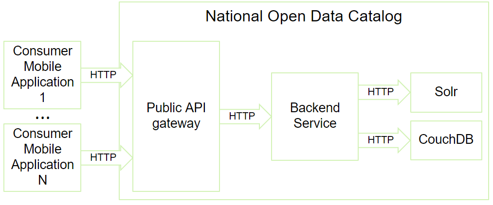

Software Architectures
===

### Table of Contents

- **SW architecture**
- **IEEE 1471 - Conceptual Framework**
  - recognizes
    - **System**
    - **Mission**
    - **Environment**
    - **Stakeholder**
    - **Concern**
    - **Architecture**
- **Architectural description (AD)**
  - consists of **Views**
    - based on **Viewpoints (VP)**
    - written down as **Models**
- some **Models** are
  - **Bass, Clemens & Kazman**
    - which defines
      - **Module VP**
        - consisting of (**static**) **Modules**
        - further sub-typed into
          - **Decomposition module VP** which shows **part of** relations
          - **Usage VP** which shows **uses** relations
          - **Class VP** which shows **is a** relations
      - **Component and Connector VP (C&C VP)**
        - consisting of (**runtime**) **Components** and **Connectors** between them
      - **Allocation VP**
        - consisting of **Modules**, **C&C** and **real world entities**
        - further sub-typed into
          - **Deployment VP** which connects **C&C** to **hardware**
          - **Implementation VP** which connects **Modules** to **files**
          - **Assignment VP** which connects **Modules** to **people**

### Software architecture

- is an abstraction, a way to deal with complex systems in an orderly manner
- a set of architectural software structures, relations between them and properties of both structures and relations
- 3 types of architectural structures are:
  1. Modules
    - **"parts of the system"**
    - each module has some computational responsibilities
    - module offers some functionality (either to the user or other modules)
    - by modularizing the system, modules can then be assigned to programming teams to be actually implemented, tested and integrated
    - they are **static structures** (as opposed to for example "modes" which can change dynamically during runtime)
  2. Components
    - **"parts of the system in runtime"**
    - structures which focus on how software elements interact with each other in runtime
    - they are made up of compiled programs from various modules
  3. Allocations
    - **"how modules and components are split to environment"**
    - they can be **organizational**, **developmental** (which teams work on which modules...), **installational** (where and how to install individual parts of the system's software...), and **executional** (how to start the software, what's the workflow...).

### IEEE 1471 - Conceptual Framework

- a standard for software architecture terminology
- it takes into account all sizes and natures of SW systems.
  - **System**
    - the central component of a software system (obviously)
  - **Mission** 
    - the goals the system aims to accomplish (create an easy-to-use social network, enable users to post pictures, like them and comment on them...)
  - **Environment** 
    - real-life entities connected to the system in any way (organization, legislations, customers, partners...)
    - it both affects the system (system needs to conform to laws, customers need to be satisfied...), and is affected by the system itself (if some parts of the system are automated, workers in that department are no longer needed...)
  - **Stakeholder**
    - Individuals and/or groups which have some intrest in the system (users, managers, admins, owners, service providers, testers, designers...)
    - these influence many aspects of the system (affordability, ease of use, security...)
    - often these intrests are in conflict with one another (affordability vs. pretty much anything else)
  - **Concern**
    - Requirements and wishes of the stakeholders as well as constraints created by the environment (laws, hardware limits)
    - they affect key characteristics of the system (usability, testability, reliability, security, performance...)
  - **Architecture**
    - should be documented in the form of **Architectural description**
    - it identifies stakeholders, their concerns, environment and its restrictions
    - it tries to address these by shaping the system
- more [here](http://web.mit.edu/richh/www/writings/ieee1471-and-SysEng-%28draft%29.pdf)

### Architectural description (AD)
- it is **complete** iff it addresses all **identified** concerns of the software system (as it's fairly hard to address non-identified ones)
- it is organized into **multiple architectural views**

### View

- **"represents the architecture from the perspective of a related set of concerns"**
- it is a part of **AD**
- it reduces complexity and makes the architecture manageable
- each view is relative to an **architectural viewpoint**
- each view consists of one or multiple **models**
- more [here](https://en.wikipedia.org/wiki/View_model)

### Viewpoint

- **captures the rules for constructing and analyzing a particular kind of view**
- it is a template for a view which can be reused in views across different system ADs
- e.g., when one looks at the front of a car and front of a chair, they see different things - views. The viewpoint itself however - looking from the front - stays the same

### Model

- **"represents system or its part (often graphically) in form relevant to its view"**
- the model also includes its "definition" - what elements and relationships it uses, how it represents them, etc.

### Bass, Clemens & Kazman model

- 3 types of viewpoints:
  - **Module viewpoint**
    - "How is the system structured as a set of code units?"
    - aimed at stakeholders with concerns about **system's complexity** (development planning, testing, reusability...)
    - its elements are **modules** 
      - static implementation units with (logically related) set of responsibilities 
      - e.g., class, interface, package, service or collection of services
      - each **includes metadata** e.g., its name, textual specification, creation date, people responsible
    - its relations are **static relationships** between them 
      - e.g., is part of, depends on, uses
    - this viewpoint answers questions such as
      - what are module's dependencies
      - which other modules use it
      - what is the functional responsibility of a module
    - it is important
      - as a basis for actual implementation of the system and its individual modules
      - for the development organization
      - for resolving significant changes during and after development
      - for response to new and/or changing user requirements
      - as a roadmap for new developers in team or when communicating with customer
    - can be further divided into
      - **Decomposition module viewpoint**
        - modules are recursively split into smaller components until they reach size that is easy to understand as a whole
        - it is a **part-of** relationship
        - some parts are omitted (such as interface specification, internal code, test plans), which is called **information hiding**
        - it is used for divide-and-conquer development approach, to analyze dependencies and connect smaller parts to bigger ones
        
      - **Usage viewpoint**
        - shows dependencies between modules in form of **uses**, etc.
        - it is used to track dependencies and see impact of changes of a specific module (e.g., which other modules need to be changed as well)
        
      - **Class viewpoint**
        - it is a **is a** kind of relationship
        - shows which modules are **sub-classes/specializations** of other modules (in the logical sense, not strict as in OOP)
        - it is used in terms of module reusability, incremental addition of functionality
        
  - **Component-connector viewpoint**
  
    - "How is the system structured as a set of elements which have runtime behavior and interactions?"
    - aimed at stakeholders with concerns about **runtime properties** (availability, performance ...)
    - although components are similar to modules, it is not 1:1 mapping (e.g., component can consist of multiple modules working together, and a module can be instantiated multiple times into multiple components)
    - elements are divided between:
      - **Components**
        - principal components
        - represent the **runtime behaviour** of the system
        - e.g., services, clients, peers, processes, threads, objects, data stores...
      - **Connectors**
        - represent interactions between components
        - e.g., method calls from another component, sending a message (REST, HTTP)
    - it shows how the system behaves in run-time, which parts ran and/or can run in parallel, what's the data flow within system, how system changes affect the runtime, how a failed component affects the availability and stability of the whole system...
    - it can show how system works in time using UML sequence diagrams
    
  - **Allocation viewpoint**
    - "How is the system related to non-software structures in the environment?"
    - aimed at stakeholders with concerns about **hardware and manpower infrastructure** (administration, maintenance, hardware requirements...)
    - shows how module and C&C viewpoints connect to the real world
    - there are 3 main sub-types:
      - **Deployment viewpoint**
      
        - connects runtime **components** and **connectors** with **hardware** elements
        - shows how the system is actually deployed in real life on hardware
      - **Implementation viewpoint**
      
        - connects static **modules** with **file structures**
        - shows where specific modules and their parts are structured in the file system
      - **Assignment viewpoint**
      
        - connects static **modules** with **people**
        - shows who is responsible for individual modules

### AD documentation template

- **Section 1: Documentation roadmap**
  - table of contents, showing user where to look
- **Section 2: System overview**
  - high-level brief description of the system, its functions, stakeholders, requirements, environment, goals...
- **Section 3: Views**
  - **Section 3.1: Documentation documentation**
    - how are views documented
  - **Section 3.2+: Specific view documentation**
    - **Section 3.2+.1: Representation**
      - one or more (graphical) representations
      - contains all the important elements and relationships
    - **Section 3.2+.2: Catalog**
      - lists elements, relationships and describes all their additional relevant data

### 4+1 Views Model

- consists of 4 viewpoints + 1 used for scenarios
  - **Logical viewpoint**
    - similar to **Module viewpoint**
    - decomposes system into **functional modules or services**, plus their important attributes and provided methods.
    - these are then decomposed into even smaller units, etc.
    - recommended UML state machine diagrams
  - **Behaviour viewpoint**
    - similar to **C&C viewpoint**, but simpler
    - decomposes sytem in runtime into **processes**, which are sequences of tasks performed by functional units from the logical viewpoint.
    - recommended UML sequence and activity diagrams
  - **Development viewpoint**
    - similar to **decomposition** and **usage viewpoints**
    - decomposes system to **software elements** which need to be developed and tested
    - describes elements' interfaces and usage between them
    - recommended UML deployment diagrams
  - **Physical viewpoint**
    - maps logical and behaviour viewpoints to **physical hardware and network configurations**
    - recommended UML deployment diagram
  - **Application scenarios**
    - describes use-cases
    - explains architecture from the functional point of view
    - demonstrates role of each module in a use case

### Requirements

- placed by stakeholders and environment
- they shape the system and its architecture
- can be:
  - **Functional requirements**
    - describe features and functionality of the system
    - most important to users
    - fulfilled by the design of the system itself
  - **Quality requirements**
    - focus on system's qualities such as **security, availability, robustness, reliability**...
    - e.g., how many requests can system handle in tandem, how easy it is to configure it, how easy testing is...
    - often not requested by user, just implied
    - fulfilled by the design or focusing on the qualities within the design (architecture often doesn't change)
  - **Constraints**
    - describes facts "from the outside"
    - e.g., laws, gravity, physics...
    - specifically **System constraints**
      - e.g., legacy third-party software the system needs to be able to use
    - fulfilled by designing the system "using" the contraints (as they are in a way architectural decisions that cannot be changed)
    - they often affect other requirements (e.g., lack of budget and time lower quality and cut off functionality)
- almost never can all requirements be fully met, they have to be prioritized and some be left out or implemented only partially

### Quality Attributes

- a measurable or testable property of a system that is used to indicate how well the system satisfies a quality requirement of a stakeholder
- can be split into
  - **System QA**
    - also called **"hard"** QA, as they are the most improtant from the view of SW architects
    - can be further split into
      - **Run-time QA**
        - "how well the system behaves in run-time"
        - e.g., **availability, perfromance, security, usability**
      - **Design-time QA**
        - e.g., **modifiablity, portability, testability, reusabilit, integrability**
  - **Bussiness QA**
    - also called **"soft"** QA, not related to the quality of the system, but how well it fits into the environment
  - **Architectural QA**
    - also called **"meta"** QA
    - related to quality of architectural design and documentation
    - more important to SW architects and dev team than users and customers
    - can be for example
      - **correctness**
        - no mistakes or contradictions in the AD
      - **completeness**
        - that AD covers all requirements
      - **buildability**
        - that system can be finished in the desired time and budget
      - **conceptual integrity**
        - that the whole architecure meets some standards/theme

- can be of types
  - **Performance QA**
    - "how long does it take for system to respond to requests"
    - can depend on
      - amount of communication between components (serialization/deserialization)
      - amount of functionality in individual components (bottleneck)
      - where components are allocated (weak hardware)
      - implemented algorithms (bad time complexity)
  - **Modifiability QA**
    - "how easily a system can be extended, parts removed or changed"
    - can depend on
      - how well is separation of concerns implemented (coupling)
      - coding techniques (badly maintained / undocumented code)
  - **Usability QA**
    - "how easily can user accomplish a desired task"
    - **not** to be confused with **user experience**
    - can depend on
      - how well UI is designed
      - presnce of optional functionality (undo, copy/paste, config save)
    - 