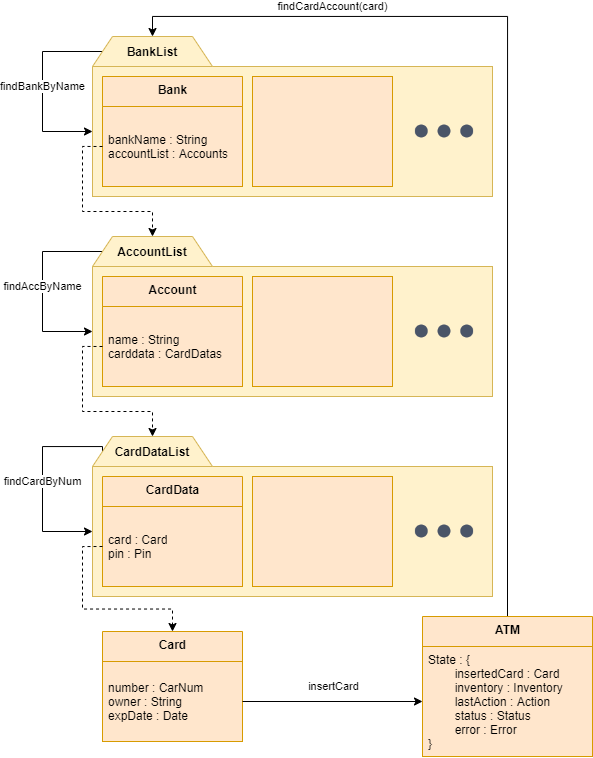

ATM
===

### Task 1: create algebraic specification of an ATM ("bankomat" in Czech)
	- state: number of available banknotes for each value (100, 200, 500, 1000, 2000)
	- operations:
		- card validation
		- checking account balance
		- cash withdrawal
		- cash deposit
		- retrieving account information from the central database of a respective bank
		- reading user PIN from keyboard

Written in maude, files: [account.maude, atm.maude, bank.maude, card.maude]

### Task 2: document your solution
	- explain key decisions and high-level design

We aimed to design an ATM able to interact with credit cards while communicating with some sort of database.

This design aims to reflect the real world
  -  pin not contained within card themselves, instead stored in banks.
  -  when pin is checked, it is sent to the bank instead of requesting the pin from there
  -  when any error occurs, it is written down and state automata ensures that ATM can be still operated upon, to avoid fatal errors.

Process:
  - The ATM is the point of interaction. It requires fixed steps to be operable.
    - insertCard(atm, card) - slots in the card
  - If this step is ommited, no other operations make any changes, only set the error to "noCardError".
    - validateCard(atm) - validates card inside the atm (currently checks the expiration date of card as well as if named bank has issued such card)
    - readUserPin(atm, pin) - sends passed in pin with card to a bank to check if pin matches.
  - If any of these steps fails, state automata never enter menu state and therefore the ATM cannot be exploited, the card can be only ejected or re-authorized

  - Afterwards, atm function can be fully accessed (withdraw, deposit, check balance... )

Structures:
- ATM
  - main object, responsible for most of the logic
  - fields:
    - atmInsertedCard : Card - reference to card inside (nilCard otherwise).
    - atmInv : Inventory - tuple of numbers specifying how many bank notes ATM currently holds
    - atmLastAction : Action - simple structure holding info about last action (used e.g. with checkBalance)
    - atmStatus : Status - state in a simple DFA (idle - communicating - authorizing - menu/full access)
    - atmError : Error - enum-like structure specifying what error arised in last operation (nilError otherwise)

- Card
  - object representing physical card, holds no sensitive data
  - fields:
    - holderName : Name - name of the owner (should be ID)
    - bankName : Name - name of the bank (should be ID)
    - cardNumber : CardNum
    - expDate : Date - expiration date

- Bank
  - object representing single bank
  - fields:
    - bankName : Name
    - accountList : AccountList - list of accounts registered within the bank

- Account
  - object representing the registered user data within a bank
  - fields:
    - ownerName : Name - same as card.holderName
    - cardList : CardDataList - list of issued cards' data

- CardData
  - object representing the card data within a bank (e.g. contains PIN in contrast to Card itself).
  - fields:
    - card : Card - reference to physical copy
    - pin : Pin - actual card's pin

### Task 3: prepare some test cases (scenarios, inputs)
	- sequences of actions with an ATM

Written in maude in [ test.maude ]