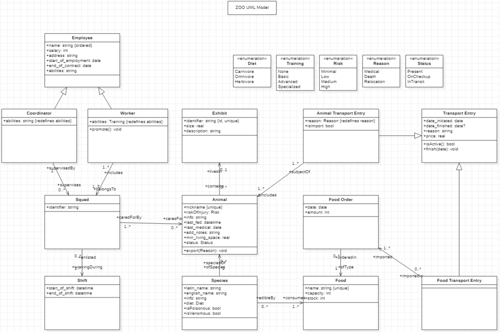

Zoo UML & OCL
===

> UML
> ===
> - vytvořit na vlastní doméně (filmy, basketbalové turnaje, ...) class diagram podobný těm, které jsou v prezentaci z přednášky
> - použít N-ární vztah
> - použít specializaci/generalizaci, generalization set
> - použít specializaci properties (atributů nebo konců asociací) s využitím subsettingu nebo redefinic
> 
> OCL
> ===
> - odevzdat minimálně 3 OCL výrazy nad vaším UML diagramem z UML úkolu, včetně jejich slovního popisu
> - z těchto tří alespoň 1x použít invariant a alespoň 1x (pre)+(post)-condition
> - zároveň alespoň 1x použít iterační operaci

### UML

UML diagram was created in StarUML software, saved in StarUMLzoo.mdj file.



### OCL

```ocl

-- Simple invariants regarding date succession

context Emlpoyee
inv: self.start_of_emplyment < self.end_of_contract
inv: self.salary >= 0

context Shift
inv: self.start_of_shift < self.end_of_shift

context TransportEntry
inv: if self.date_finished != NULL implies
        self.date_initiated < self.date_finished

-- Promotion moves Worker to Coordinator, removes them from all squads (and from workers)

context Worker::promote() : void
pre: -- none
post: self.belongsTo.forAll(squad | self not in squad.includes)

-- Export moves the animal to transit.
-- - only if animal is present in zoo
-- - only if squad on duty can handle it
-- - flags the animal as in transit
-- - creates a new transport instance for it

context Animal::export(Reason exportReason) : void
pre: self.status is Status::Present and 
     self.caredForBy.includes.exists(worker | worker.abilities >= self.riskOfInjury)
post: self.status == Status::InTransit and
      self.subjectOf.exists(transport | not transport.isImport and 
                                        transport.reason == exportReason and
                                        transport.isActive())


```