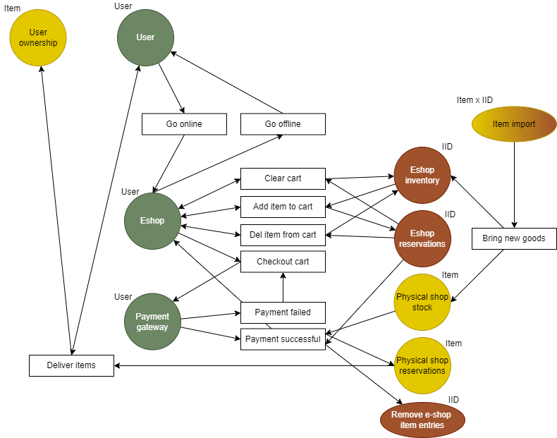

Couloured Petri Nets - e-shop
===

> task 1: create model for the whole process associated with online shopping (Amazon, Alza.cz)
> 	- you should capture in particular the following steps: choosing items, payment by credit card, authorization on cell phone, checkout from store, delivery
> 	- other important aspects: multiple clients using the e-shop at the same time
> 
> task 2: document your solution
> 	- explain key overall design decisions

### Required operations
- choosing items
- payment by credit card
- authorization on cell phone
- checkout from store
- delivery

### General ideas

- requirements include "offline" processes as well (delivery), therefore the system cannot only include the browser and server interaction
- we therefore need multiple interacting modules, namely:
  - user (online) - opening webpage, browsing items, selecting them, managing cart, buying items...
  - eshop (server) - managing inventory, item stocks...
  - physical shop - stocking physical items, updating eshop, packaging and sending items...
  - user (offline) - their own inventory at home, receiving items...

### Diagram

### Declarations

Data types:
- type **User** = person - physical entity
- type **Item** = product - physical entity
- type **IID** = number - internal ID of a specific item type

Note: I'm not sure if including physical entities into the net is considered "correct". On the other hand, the net could be altered to avoid this:
- User could be replaced by a record containing relevant data (PC IP for cookies and cart persistence, credit card info for payment in gateway...)
- Item could be removed from net altogether by instead adding specific end-points which would initiate the process in the real world (e.g. after successful payment the item ID could be passed out to a place called e.g. "Storage control" which would take care of shipping the item)

### Concurrency

Due to the e-shop being split into 2 pools - inventory and reservations, multiple users should not run into issues.

Once a user adds an item to cart, it's entry in inventory is passed into reservations pool and should therefore an item become "out of stock", there will be no tokens of it left in inventory for another user.

Similarly with buying an order. Should a user complete the order, all items in their cart have tokens already in reservation pool and therefore it should not happen that upon checkout the user realizes there's not enough items in stock to finish the order.

The only thing that is not considered here is the fact that a user can abandon a cart, which will lock the items for other potential customers. This could be resolved by automatically releasing the user's cart from the reservation pool upon logging off, and then trying to refill the pool once they come back online (e.g. via user's cookies), as their reservation during not browsing has lower priority than availability of unbought items for other users.