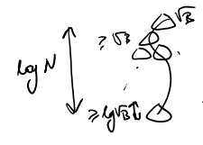

# Preliminaries

- **data structure** - black box containing some **data** and providing certain **operations** on top of it
- **queries** - non-altering operations returning some data state
- **updates** - altering operations changing data
- **static** data structure - once built, no longer updated
- **dynamic** data structure - can be updated at any time
- structure **interface** - set of methods for accessing the data structure
- structure **implementation** - internal layout of data in memory and procedures handling operations

# Ammortized analysis

**Amortized complexity** "is the total expense per operation, evaluated over a sequence of operations."

In other words, amortized complexity says what's the upper bound of operation cost in a larger sequence of operations.

- consider the worst time per operation $T$
- meaning $k$ operations take time at most $kT$
- however, if we use amortized complexity, we can improve the upper bound estimate
- if we speculate an **amortized cost** per operation $A$, then it holds that $k$ operations take time at most $kA \le kT$ (amortized cost often substantially better than worst cost)

- another way to look at it is that amortized cost $A$ "piles up" when performing easy operations and gets used up on long operations.

## Flexible arrays

- dynamic array which can expand/shrink once it passes certain thresholds
- has to be reallocated and copied when expanding/shrinking

### Complexity analysis

We claim that **amortized cost** $A = 3$ ($k$ operations take $\le 3k$ time).
Further, the **real cost** $R$ is at most $A$.

## Splay trees

## (a,b)-trees

- $O(n)$ štepení pri $n$ insertoch do prázdneho stromu
- ak $b \ge 2a$, tak počet štepení/zlievaní pri $m$ insertoch a $l$ deletoch je $O(m + l)$

$\Phi = 2 \cdot \#a + 1 \cdot \#(a+1) + 2 \cdot \#(b-1) + 4 \cdot \#b$,  
    kde $\#a =$ počet vrcholov majúcich $a$ potomkov v strome

### Insert

- máme $t$ vrcholov s $b$ synmi, kt. sa rozštipia na $2t$ vrcholov, aspoň $t$ z nich bude mať $\ge a+1$ a $\le b-1$ synov.
- teda:
  - zanikne **určite** $t$ vrcholov v $\#b$
    - $-4t$
  - vznikne **najviac** $t$ vrcholov v $\#a$
    - $+2t$
  - vznikne **najviac** $t$ vrcholov v $\#(a+1)$
    - $+1t$
  - vznikne **možno** $1$ vrchol (koreň) v $\#b$
    - $+4$
- $\Delta\Phi \le - 4t + 2t + 1t + 4 = 4 - t$
- $R = 1 + t$ (insert + splity)
- $A \le 5$

### Delete

- máme $s$ dvojíc vrcholov s $a$ synmi, kt. sa spoja do $s$ vrcholov s $2a-1$ synmi
- teda:
  - zanikne **určite** $2s$ vrcholov v $\#a$
    - $-2 \cdot 2s$
  - vznikne **najviac** $s$ vrcholov v $\#(b-1)$ (z $2a-1$)
    - $+2s$
  - vznikne **možno** $1$ vrchol v $\#b$ ($p'$ z $p$)
    - $+4$
  - vznikne **možno** $1$ vrchol v $\#b$ ($q'$ z $q$)
    - $+4$
- $\Delta\Phi \le -2 \cdot 2s + 2s + 4 + 4 = 8 - 2s$
- $R = 1 + 2s$ (insert + merge)
- $A \le 9$

# Caching

- complexity is measured in number of **blocks read** from memory needed to complete the algorithm.

- 2 types of memory:
  - **External** - potentially infinite in size, contains arbitrary items in fixed-size blocks
  - **Internal** - for $M$ items, organized in $B$-sized blocks

- types of cache models:
  - **Cache-aware (CA)** - knows parameters of cache, can optimize algorithm
  - **Cache-oblivious (CO)** - doesn't know parameters so tries to "work for every cache"

## Scanning an array

- sequential scan
- CA algo takes $\lceil N/B \rceil \le N/B + 1$
- CO algo can take an additional read (e.g. array of size on the edge of 2 blocks).

## Mergesort

Time complexity:
- we pass each $\lceil \log N \rceil$ times (sort sets of 2, 4, 8...)
- each pass takes $\Theta(N)$ time
- reaching overall complexity of $\Theta(N \log N)$

I/O complexity:
- a single pass requires $O(T/B + 1)$ reads, where 
  - $T$ is number of items
  - $B$ is number of items per block
- since we need $\log N$ passes, we reach I/O complexity of $O(T/B\cdot \log N + \log N)$
- and since "$+1$" is only significant when $N < B$, we can fit it in cache in one go and don't need the $\log$ passes, so we get $O(T/B\cdot \log N + 1)$

## Multi-way Mergesort

Time complexity:
- K-way mergesort combines $K$ runs at the same time, decreasing passes to $\lceil \log_K N \rceil = \lceil \log N / \log K \rceil$
- in each step a minimum of $K$ items has to be found. Can be done in heap, reaching $\Theta(\log K)$ for each _Min()_.
- that takes $\Theta(T \log K)$ for $T$ items
- making Mergesort run in $\Theta(N \log K \cdot \log N / \log K) = \Theta(N \log N)$ for any $K$

I/O complexity:
- if cache is large enough, I/O complexity is $O(T/B + K)$. $K$ is for when all runs are in separate blocks. It can be run in continuous memory getting $O(T/B + 1)$.
- with $\log_K N$ passes we get total I/O complexity $O(N/B\cdot \log N / \log K + 1)$

- how high can $K$ go?
- Need $K+1$ blocks for scan (+ result block)
- $K-1$ blocks are enough for the heap
- so we need $M \ge 2BK$
- if we know $M$ and $B$ in advance, we set $K = \frac{M}{2B}$ for best efficiency
- that way we get I/O complexity $O(N/B\cdot \log N / \log \frac{M}{B} + 1) =$

## Matrix transposition

- usually stored in row-major mode
- read by rows then takes $O(N^2/B+1)$ reads
- read by cols can reach $\Theta(N^2)$
- transposing by triangles is no good then, as we access the other by columns

### Tiling algorithm

- split matrix to $d \times d$ tiles, possibly rectangular
- we get $\lceil N/d \rceil^2 \le (N/d + 1)^2 \in O(N^2/d^2 + 1)$ tiles
- if $B | N$, we can align matrix to block, so every row starts with new block
- if we set $d = B$, each row of block is contained in a block too, meaning we could process tile in $O(B)$ I/O ops for large enough cache
- for $N^2/B^2$ blocks that means $O(N^2/B)$ reads

Requirements:
- we need to work with 2 tiles at once, so $M \ge 2B^2$, referred to as **tall-cache property**
- more generally tall cache has $M \in \Omega(B^2)$
- for any constant in $\Omega$ we can simply split the tile to a small enough subtiles and algo won't change asymptotically.

Non-aligned:
- if $B \nmid N$, we lose alignment but it's still fine
- if e.g. $B \times B$ block's row spans 2 blocks, that's $2B$ I/O ops, still $\in O(B)$
- cache has to contain $4B^2$ items this way

### Cache-oblivious

- using **divide and conquer** strategy
- recursively split matrix into 4 submatrices, transpose individually
- altogether $n^2$ operations
- altogether $O(n^2/B)$ I/O ops
- assumes **tall-cache property**

#### Proof

- at some point we reach submatrices which can fit into $B$ blocks
- there is $\frac{N}{B/2} \times \frac{N}{B/2} = 4 \frac{N^2}{B^2}$ such submatrices
- resulting in $4\frac{N^2}{B^2} \cdot B = 4\frac{N^2}{B}$ I/O ops

## Saving tree in memory

- saved row-wise like a normal heap
- traversing path takes $\log \frac{N}{B}$ I/O transfers

## Van Emde Boas tree

- each tree recursively branching into $\sqrt{n}$ subtrees of size $\sqrt{n}$
- each subtree is saved in continuously in memory
- tree of size $\le B$ saved in $O(1)$ continuous blocks

### Traversing

- path goes through $\le \log N / \log \sqrt{B}$ subtrees
- altogether $O(\frac{\log N}{\log B})$ I/O transfers

### Sorting

- Mergesort takes $O(\frac{n}{B} \log n)$ I/O transfers
- K-way mergesort takes $O(\frac{n}{B} \log_K n)$ I/O transfers
- Funnelsort takes $O(\frac{n}{B} \log_{M/B} n)$ I/O transfers

# Cache management

- which block to throw out from cache when full?
  - we don't know the future
  - asociative cache

## Sleator-Tarjan (1985)

- **LRU strategy**
  - throw out block not used the longest
- **OPT strategy**
  - throw out block which will not be needed the longest
  - requires knowing the future

For sequence of accesses $s_1,\dots,s_N$:
$$
    C_{LRU} \le \frac{M_{LRU}}{M_{LRU}-M_{OPT}} \cdot C_{OPT} + M_{LRU}
$$
where $M$ is size of the cache (in blocks), $C$ is number of cache misses.

Proof:

- split sequence $s_1,\dots,s_N$ to $K$ groups, such that each group requires $M_{LRU}$ unique blocks (except for the last one if there's not enough accesses).
- LRU has at most $M_{LRU}$ misses on each group
  - has to load all $M_{LRU}$ unique blocks, but might some have loaded already
- OPT has at least $M_{LRU} - M_{OPT}$ misses on each group
  - it might have prepared for as many reads as possible, but still can't contain all blocks if its size is smaller than $M_{LRU}$
- $C_{LRU} \le M_{LRU} \cdot K$
  - at worst it missed each of $M_{LRU}$ unique blocks in each of $K$ groups
  - but it probably had some stored from previous runs by luck
- $C_{OPT} \ge (M_{LRU} - M_{OPT}) \cdot (K - 1)$
  - because of the 3rd point
  - $K-1$ just because last group isn't guaranteed to have $M_{LRU}$ unique blocks (that's basically why M_{LRU} is added in the inequality itself)
- putting together we get:
$$
    \frac{C_{LRU}}{M_{LRU}} \le K = \frac{C_{OPT}}{(M_{LRU}-M_{OPT})} + 1
$$

# Hashing

## Dictionary problem

- universe $U$, $S \subseteq U$, $|S|=n$
- we want to represent $S$
- supported ops:
  - Find(x), Member(x)
  - Insert(x)
  - Delete(x)

### Naive solution

- array of size $|U|$
- info about $x$ at index $x$.

### Better solution

- hashing in array of size $m \ge n$
- $h: U \rightarrow \{1,\dots,m\}$ hashing function
- $x$ stored at $h(x)$
- 