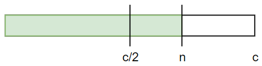
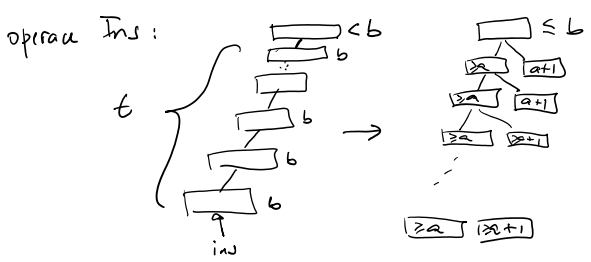
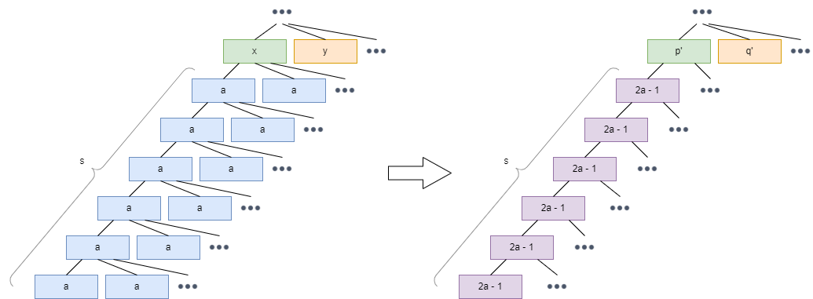

NTIN066 - Datové Struktury

### Glossary

- **data structure** - black box containing some **data** and providing certain **operations** on top of it
- **queries** - non-altering operations returning some data state
- **updates** - altering operations changing data
- **static** data structure - once built, no longer updated
- **dynamic** data structure - can be updated at any time
- structure **interface** - set of methods for accessing the data structure
- structure **implementation** - internal layout of data in memory and procedures handling operations

### Ammortized analysis

**Amortized complexity** "is the total expense per operation, evaluated over a sequence of operations."

In other words, amortized complexity says what's the upper bound of operation cost in a larger sequence of operations.

- consider the worst time per operation $T$
- meaning $k$ operations take time at most $kT$
- however, if we use amortized complexity, we can improve the upper bound estimate
- if we speculate an **amortized cost** per operation $A$, then it holds that $k$ operations take time at most $kA \le kT$ (amortized cost often substantially better than worst cost)

- another way to look at it is that amortized cost $A$ "piles up" when performing easy operations and gets used up on long operations.

### Flexible arrays

- dynamic array which can expand/shrink once it passes certain thresholds
- has to be reallocated and copied when expanding/shrinking

#### Complexity analysis

We claim that **amortized cost** $A = 3$ ($k$ operations take $\le 3k$ time).
Further, the **real cost** $R$ is at most $A$.

### Splay trees

### (a,b)-trees

- $O(n)$ štepení pri $n$ insertoch do prázdneho stromu
- ak $b \ge 2a$, tak počet štepení/zlievaní pri $m$ insertoch a $l$ deletoch je $O(m + l)$

$\Phi = 2 \cdot \#a + 1 \cdot \#(a+1) + 2 \cdot \#(b-1) + 4 \cdot \#b$,  
    kde $\#a =$ počet vrcholov majúcich $a$ potomkov v strome

#### Insert

- máme $t$ vrcholov s $b$ synmi, kt. sa rozštipia na $2t$ vrcholov, aspoň $t$ z nich bude mať $\ge a+1$ a $\le b-1$ synov.
- teda:
  - zanikne **určite** $t$ vrcholov v $\#b$
    - $-4t$
  - vznikne **najviac** $t$ vrcholov v $\#a$
    - $+2t$
  - vznikne **najviac** $t$ vrcholov v $\#(a+1)$
    - $+1t$
  - vznikne **možno** $1$ vrchol (koreň) v $\#b$
    - $+4$
- $\Delta\Phi \le - 4t + 2t + 1t + 4 = 4 - t$
- $R = 1 + t$ (insert + splity)
- $A \le 5$

#### Delete

- máme $s$ dvojíc vrcholov s $a$ synmi, kt. sa spoja do $s$ vrcholov s $2a-1$ synmi
- teda:
  - zanikne **určite** $2s$ vrcholov v $\#a$
    - $-2 \cdot 2s$
  - vznikne **najviac** $s$ vrcholov v $\#(b-1)$ (z $2a-1$)
    - $+2s$
  - vznikne **možno** $1$ vrchol v $\#b$ ($p'$ z $p$)
    - $+4$
  - vznikne **možno** $1$ vrchol v $\#b$ ($q'$ z $q$)
    - $+4$
- $\Delta\Phi \le -2 \cdot 2s + 2s + 4 + 4 = 8 - 2s$
- $R = 1 + 2s$ (insert + merge)
- $A \le 9$