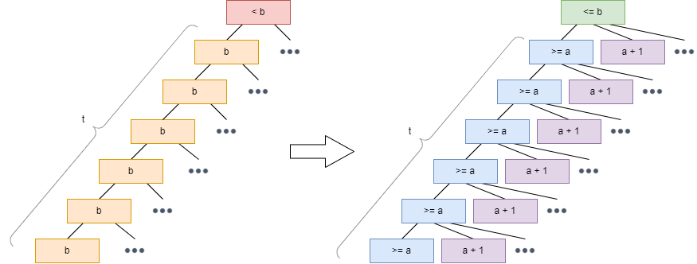
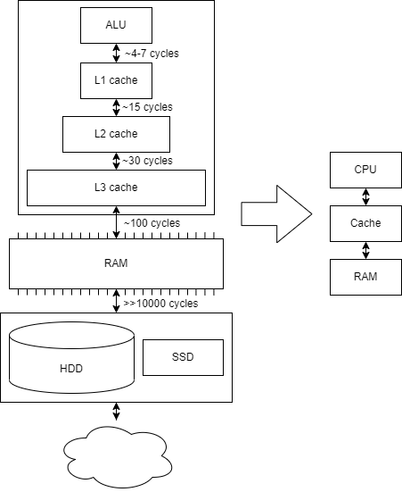

<style>
  doubt {
    color: orange;
    display: inline-block;
    border: 1px solid orange;
    padding: 2px;
  }
</style>

# Preliminaries

- **data structure** - black box containing some **data** and providing certain **operations** on top of it
- **queries** - non-altering operations returning some data state
- **updates** - altering operations changing data
- **static** data structure - once built, no longer updated
- **dynamic** data structure - can be updated at any time
- structure **interface** - set of methods for accessing the data structure
- structure **implementation** - internal layout of data in memory and procedures handling operations

# Ammortized analysis

**Amortized complexity** "is the total expense per operation, evaluated over a sequence of operations."

In other words, amortized complexity says what's the upper bound of operation cost in a larger sequence of operations.

- consider the worst time per operation $T$
- meaning $k$ operations take time at most $kT$
- however, if we use amortized complexity, we can improve the upper bound estimate
- if we speculate an **amortized cost** per operation $A$, then it holds that $k$ operations take time at most $kA \le kT$ (amortized cost often substantially better than worst cost)

- another way to look at it is that amortized cost $A$ "piles up" when performing easy operations and gets used up on long operations.

## Flexible arrays


- dynamic array which can expand/shrink once it passes certain thresholds
- has to be reallocated and copied when expanding/shrinking

### Complexity analysis

We claim that **amortized cost** $A = 3$ ($k$ operations take $\le 3k$ time).
Further, the **real cost** $R$ is at most $A$.

Let's set $s_0, s_1, \dots$ sequence of operations on the flexible array.  
Let $c_i$ be the capacity of array after operation $i$. E.g., if we only consider insert operations $c$ changes during step $i=2^k$ ($c_{new}=2c_{old}$)

We easily see that the real cost $R$ of an operation is either: 
$$
  R_i = \left\{
  \begin{array}{cl}
    i + 1 & \textrm{when expanding (copy + insert)} \\
    1 & \textrm{otherwise}
  \end{array} \right.
$$

Let's set the potential 
$$\Phi_i = 2(i - c/2) = 2i - c$$
The thought being that we need $2$ points each inserted element. $1$ for adding it, and $1$ for later when we'll need to move it during expansion.

Now we show that amortized cost $A \le 3$ as we claim.

$A_i = R_i + \Delta \Phi_i$  
$A_i = R_i + (\Phi_i - \Phi_{i-1})$

We again have 2 cases.:
- when simply adding element ($i\ne2^k$)  
  $A_i = 1 + ((2i - c) - (2(i - 1) - c) = 3$
- and when also expanding  
  $A_i = (i + 1) + ((2i - c_{new}) - (2(i - 1) - c_{old}))$  
  $A_i = i + 1 + 2i - 2c - 2i + 2 + c = 3$
  - as $c_{new}=2c_{old}$ and $i=c_{old}$

## Weight-balanced tree

- "a binary search tree which rebalances only parts of itself which degrade too much"

- Define:
  - $l(v)$ - left child of vertex $v$
  - $r(v)$ - right child of vertex $v$
  - $s(v)$ - number of vertices in subtree with root $v$ (incl. $v$)
- Then:
  - tree is $\alpha$-weight-balanced iff $\forall v:$
  $$s(l(v)) \le \alpha s(v) \wedge s(r(v)) \le \alpha s(v)$$
- we consider case $\alpha = \frac{2}{3}$

### Find(x)
- works in time $O(\log n)$
- depth is
  $$d \le \log_{2/3}\frac{1}{n} = \log_{3/2}n \in O(\log n)$$
  - because:
    - consider path from root to some leaf
    - at maximum, each next step goes into subtree of size $\frac{2}{3}s(v)$
    - in such case in leaf we reach subtree of size $\left(\frac{2}{3}\right)^d n = 1$

### Insert(x)
- works in time $O(\log n)$
- step where invariant is not broken, it simply takes $O(\log n) + O(1)$ to find a place and insert
- step where invariant is broken:
  - it means that for some subtree of some vertex $v$ we get w.l.o.g. 
    $$s(l(v))>\frac{2}{3}s(v)$$
  - it also means that
    $$s(r(v)) = s(v) - s(l(v) < \frac{1}{3}s(v)$$
  - we can pick highest such $v$ (with biggest subtree) as the invariant could only be broken by increasing subtrees along the path where new item was inserted
  - then we can rebuild it in $O(s(v))$ time (e.g. using altered DFS to make it into a sorted array and create subtree using it)
  - let's define potential as
    $$\Phi = C\sum_v r(v)$$
    for some well-chosen constant $C$, where
    $$
    r(v) = \left\{
    \begin{array}{cl}
      |s(l(v) - s(r(v))| * & \textrm{when the term} * \textrm{is} \ge 2 \\
      0 & \textrm{otherwise}
    \end{array} \right.
    $$
  - during the step where no rebalancing is made, potential increases by $O(\log n)$
    - that is because the only vertices $v$ along path are affected, where the term $*$ can increase by at most $1$ (and therefore $r(v)$ can at most jump by $2$)
  - during the step where rebalancing is made, potential changes by $\Delta\Phi \le C\frac{s(x)}{3}$, where $x$ is the highest vertex along path of insertion, where invariant is broken
    - that is because whole subtree of $x$ is rebalanced, thereby reaching $r(x)=0$ (as well as $r(v) = 0$ for all descendants of $x$). As we know the invariant is broken, using our observations from before:
    $$s(l(v)) > \frac{2}{3}s(r(v)) \wedge s(r(v)) < \frac{1}{3}s(v)$$
    $$\implies s(l(v)) - s(r(v)) > \frac{1}{3}s(v)$$
    - then, by rebuilding the subtree we lower the potential by $>s(v)$
  - altogether we get
    $$
      A_i = \left\{
      \begin{array}{cl}
        O(\log n) + O(\log n) & \textrm{non-balancing step} \\
        O(s(x) + \log n) - C\frac{s(x)}{3} & \textrm{balancing step}
      \end{array} \right.
    $$
    therefore
    $$A_i = O(\log n)$$

## Splay trees

- trees where **all operation splay a node** (move it to the root)
  - when searcing, searched node is splayed
  - when inserting, new node is splayed
  - when deleting, splay either deleted node succesor or predecessor
- utilizes rotations to splay, most importantly **double rotations**
  - **ZIG-ZIG**  
    
    - when node is on the "same side" as parent
    - **rotate(p,g)** then **rotate(x,g)**
  - **ZIG-ZAG**  
    
    - when node is on the "other side" as parent
    - **rotate(x,p)** then **rotate(x,g)**
  - **ZIG**  
    
    - when node's parent is root
- when splaying a node, all below move approximately half-way closer to root
- let's define
  - $T(v)$ **subtree** of $v$
  - $s(v) = |T(v)|$ **size** of subtree of $v$
  - $r(v) = \log s(v)$ **rank** of $v$
  - $\Phi = \sum_v r(v)$ potential as sum of ranks

### Splay(x)
- we claim that $A \le 3(r'(x)-r(x)) + 1$, where $r'(x)$ is rank after operation
- to prove this, we look at all rotations in detail
- real cost $R$ is $2$ for zig-zig and zig-zag, $1$ for zig
- $\Delta\Phi$ is only dependent on ranks of $x, p$ and $g$
  - all vertices in sub-trees A, B, C, D don't change at all
  - all vertices whose sub-trees contain $x,p,g$ (and in turn the whole sub-tree we're analyzing) do change in structure, but their sizes also remain the same
- one important fact used here is that
  $$\log\frac{\alpha+\beta}{2} \ge \frac{\log a + \log b}{2}$$
  that simply comes from the fact that logarithmic function is convex and therefore it holds that mean value of two function values is at most function value of their mean
- **ZIG-ZIG**
  $$A_i = 2 + r'(x) - r(x) + r'(p) - r(p) + r'(g) - r(g)$$
  $s'(x) = s(g) \implies r'(x) = r(g)$
  $$A_i = 2 + r'(p) + r'(g) - r(x) - r(p)$$
  now we see that  
  $s(x) + s'(g) + 1 = s'(x)$  
  using the logarithm inequality:  
  $r(x) + r'(g) = \log(s(x)) + \log(s(g)) \le 2 \log \frac{s(x) + s(g)}{2} \le 2r'(x) - 2$  
  so we get  
  $r'(g) \le 2r'(x) - r(x) - 2$
  $$A_i \le 2r'(x) - 2r(x) + r'(p) - r(p)$$
  next we easily see that $r'(p)<r'(x)$ and $r(p)<r(x)$
  $$A_i \le 3r'(x) - 3r(x)$$
- **ZIG-ZAG**
  $$A_i = 2 + r'(x) - r(x) + r'(p) - r(p) + r'(g) - r(g)$$
  similarly to ZIG-ZIG  
  $s'(p) + s'(g) + 1 = s'(x)$  
  so analogically  
  $r'(p) + r'(g) \le 2r'(x) - 2$
  $$A_i \le 3r'(x) - r(x) - r(p) - r(g)$$
  now to achieve claim, we easily see that $r(p) > r(x)$ and $r(g) > r(x)$
  $$A_i \le 3r'(x) - 3r(x)$$
- **ZIG**
  $$A_i = 1 + r'(x) + r'(p) - r(x) - r(p)$$
  it is easy to see that $r'(x) > r'(p)$ and $r(x) < r(p)$
  $$A_i \le 2r'(x) - 2r(x) + 1 \le 3(r'(x) - r(x)) + 1$$
  as $r'(x) \ge r(x)$
  $$A \le \sum_{i=1}^t A_i \le \sum_{i=1}^t 3(r_i(x) - r_{i-1}(x)) + 1$$
  which is a telescopic sum
  $$A \le 3(r_t(x) - r_0(x)) + 1 \le 1 + 3\log n$$
  we can use $1$ instead of $t$ as we know ZIG is only used once
- so we get amortized $Splay(x) \in O(\log n)$
- the real cost however also incorporates the potential difference, which is again a telescopic sum in
  $$R \le A - \Delta\Phi = A - \Phi_t + \Phi_0 \le A - 0 + n \log n$$
- finally we get that $m$ splays on $n$-node tree runs in $O((m+n)\log n)$

### Find(x)
- successful find finds the node in depth $\Theta(d)$
- subsequent splay also takes $\Theta(d)$, but amortized $O(\log n)$
- similarly for unsuccessful find, which only reaches leaf
- this doesn't change the potential
- added up, whole find op, takes amortized $2O(\log n)$

### Insert(x)
- passes down the tree
- if finds the inserting node, it's analogic to Find(x)
- otherwise it reaches leaf, adds inserted node as child and splays it
- it can change the potential, which might be a problem
  - consider path $v_1,\dots,v_{t+1}$, where $v_{t+1}$ is the added leaf
  - only potential of nodes along the traversed path are changed
  - $\Delta\Phi = \Phi' - \Phi = r'(v_{t+1}) + \sum_{i=1}^t (r'(v_i)-r(v_i))$
  - we know that $s'(v_{t+1}) = 1 \implies r'(v_{t+1}) = 0$
  - for other nodes, we know that $r'(v_i) = \log (s'(v_i) + 1) \le \log s'(v_{i-1}) = r(v_{i-1})$
  - this inequality is sufficient to bound the potential change, as:  
    $\Delta\Phi \le r'(v_1) - r(v_1) + \sum_{i=2}^t (r(v_{i-1}) - r(v_i))$
  - which is a telescopic sum, obtaining:  
    $\Delta\Phi \le r'(v_1) - r(v_t) \le \log n$
- by bounding it we get amortized cost of insert of $O(\log n)$

### Delete(x)
- pass down the tree
- if it's leaf, remove
- if it has one child, replace it
- if it has two children, find and replace by e.g. its successor
- potential changes, but is decreased, so it doesn't pose a problem for cost
- apart from that, deleting takes constant time, so does replacing, and other than that it's just search which works in amortized $O(\log n)$

### Static optimality
- consider accessing nodes $x_1,\dots,x_k$, $t_1,\dots,t_k$ times in total respectively during some sequence of operations
- the sequence will then take $O(n\log n + \sum t_i\log\frac{n}{t_i}) = O(n\log n + mH(X))$
  - where $X = (\frac{t_1}{m},\dots,\frac{t_k}{m})^T$ distribution, and $H(X)$ is its entropy
- this states that a splay tree containing these keys performs in $O$ of expected time of any arbitrary (including an optimal) static tree.
- in other words, with the difference of a multiplication constant, splay tree is able to perform as well as any other static tree on the same elements

### Working set bound
- again consider accessing nodes $x_1,\dots,x_k$ in sequence $s_1,\dots,s_m$
- let us denote $z_1,\dots,z_m$ signifying number of different elements accessed between this ($s_i$) and previous ($s_{i-z_i}$) access of currently accessed element
- this sequence will take $O(n\log n + m + \sum_{i=1}^m \log(1+z_i))$
- this takes advantage of the fact that frequently accessed elements are kept closer to the root
- the more different elements are accessed, the "deeper" is the element pushed down

## (a,b)-trees

- tree where each internal node contains between $a$ and $b$ children
- root contains between $2$ and $b$ children
- all leafs are on the same level
- only leaves contain inserted keys
- internal nodes contain only boundaries and can be redundant
- $(a,b)$-tree of depth $d$ has at $a^{d-1} \le l \le b^d$ leafs
  - <doubt>shouldn't it be $a^d$</doubt>
- $(a,b)$-tree with $l$ leaves has $\log_b n \le d \le 1 + \log_a n$
- each internal node remembers maximas of all its subtrees 
- $O(n)$ splits during $n$ inserts into an empty tree
- if $b \ge 2a$, then the number of splits/merges during $m$ inserts and $l$ deletes is $O(m+l)$
- let's define
  - $\Phi = 2 \cdot \#a + 1 \cdot \#(a+1) + 2 \cdot \#(b-1) + 4 \cdot \#b$,  
    where $\#a =$ number of vertices which have $a$ descendants

### Find(x)
- simply go down the tree. At each node, use bounds to determine which child to pick next
- bounds in node can be in sorted array - use binary search
- time $\le \log_b n \cdot O(\log b) = O(\log n)$
  - time = find appropriate bounds * path down the tree
  - $\log b < \log n$ in most cases

### Insert(x)

- find node above leafs where to insert
- if it has $<b$ children, insert
  - time as in Find $O(\log n)$
- if it has $=b$ children, split
  - create $2$ new nodes of sizes $\lfloor\frac{b-1}{2}\rfloor$ and $\lfloor\frac{b+1}{2}\rfloor$
  - recursively insert these new nodes instead of the old one in the parent



- consider an arbitrary insert which triggers splitting
- split propagates through $t$ vertices
  - each of them has to contain $b$ children in order to be split
  - by definition, by splitting them we obtain $2$ new vertices for each of them, of sizes $\ge a$ and $a+1$ respectively
  - additionally, the first node along the path **not** to split was of size $<b$, but after increased by $1$, therefore can be of size $\le b$
- now we consider the upper bound of $\Delta\Phi$ (as we're trying to find the upper bound of amortized complexity)
  - $t$ nodes in $\#b$ are lost exactly
  - $t$ vertices in $\#a$ are added at most 
  - $t$ vertices in $\#(a+1)$ are added at most
  - $1$ vertex in $\#b$ is added at most
- altogether
  - $\Delta\Phi \le - 4t + 2t + 1t + 4 = 4 - t$
  - $R = 1 + t$ (insert + splits)
  - $A \le 5$
  - amortized time as in Find $O(\log n)$ + constant

### Delete(x)

- find node which contains $x$
- if it has $>a$ children, remove
  - time as in Find $O(\log n)$ + constant
- if it has $=a$ children
  - if some one of its direct neighbors has $>a$ children, "borrow$ one
    - either left-most of right neighbor or right-most of left neighbor
    - fix bounds in parent accordingly
    - time as in Find $O(\log n)$ + constant
  - if all have $=a$ children, delete merge with neighbor
    - take their $2a-1$ remaining leafs, and create new node
    - recursively delete node in parent


- consider an arbitrary delete which triggers merging
- merging propagates through $s$ levels
  - each level contains $2$ neighboring nodes of size $a$ (as merging was done instead of borrowing from neighbors)
  - on top, vertices $x$ and $y$ have necessarily more children ($x + y \ge 2a + 1$), as they didn't continue with the merge
  - after the merging, we obtain $s$ vertices of size $2a-1$, and finally increasing overall size of $p' + q'$ by $1$
- again consider $\Delta\Phi$
  - $2s$ nodes in $\#a$ were lost exactly
  - $s$ nodes in $\#(b-1)$ were added $(2a-1<b)$
    - <doubt>$2a-1 \le b$ mentioned in lecture though</doubt>
  - $2$ nodes in $\#b$ were added at most ($p'$ and $q'$)
- $\Delta\Phi \le -2 \cdot 2s + 2s + 2\cdot4 = 8 - 2s$
- $R = 1 + s$ (insert + merge)
- $A \le 9 - s \le 9$
  - as $s \in \mathbb{N}$
- amortized time as in Find $O(\log n)$ + constant

# Caching

- when measuring external memory performance, we compute complexity with regards to number of **read blocks** from external memory into cache
- for the sake of simplicity, we ignore most of the architecture and only look at interaction between (CPU - cache - outside world)



- complexity is measured in number of **blocks read** from memory needed to complete the algorithm.

- 2 types of memory:
  - **External** - potentially infinite in size, contains arbitrary items in fixed-size blocks
  - **Internal** - for $M$ items, organized in $B$-sized blocks

- types of cache models:
  - **Cache-aware (CA)** - knows parameters of cache, can optimize algorithm
  - **Cache-oblivious (CO)** - doesn't know parameters so tries to "work for every cache"

## Scanning an array

- sequential scan
- CA algo takes $\lceil N/B \rceil \le N/B + 1$
- CO algo can take an additional read (e.g. array of size on the edge of 2 blocks).

## Mergesort

Time complexity:
- we pass altogether $\lceil \log N \rceil$ times (sort sets of 2, 4, 8...)
- each pass takes $\Theta(N)$ time
- reaching overall complexity of $\Theta(N \log N)$

I/O complexity:
- a single pass requires $O(T/B + 1)$ reads, where 
  - $T$ is number of items
  - $B$ is number of items per block
- since we need $\log N$ passes, we reach I/O complexity of $O(T/B\cdot \log N + \log N)$
- and since "$+1$" is only significant when $N < B$, we can fit it in cache in one go and don't need the $\log$ passes, so we get $O(T/B\cdot \log N + 1)$

## Multi-way Mergesort

Time complexity:
- K-way mergesort combines $K$ runs at the same time, decreasing passes to $\lceil \log_K N \rceil = \lceil \log N / \log K \rceil$
- in each step a minimum of $K$ items has to be found. Can be done in heap, reaching $\Theta(\log K)$ for each _Min()_.
- that takes $\Theta(T \log K)$ for $T$ items
- making Mergesort run in $\Theta(N \log K \cdot \log N / \log K) = \Theta(N \log N)$ for any $K$

I/O complexity:
- if cache is large enough, I/O complexity is $O(T/B + K)$. $K$ is for when all runs are in separate blocks. It can be run in continuous memory getting $O(T/B + 1)$.
- with $\log_K N$ passes we get total I/O complexity $O(N/B\cdot \log N / \log K + 1)$

- how high can $K$ go?
- Need $K+1$ blocks for scan (+ result block)
- $K-1$ blocks are enough for the heap
- so we need $M \ge 2BK$
- if we know $M$ and $B$ in advance, we set $K = \frac{M}{2B}$ for best efficiency
- that way we get I/O complexity $O(N/B\cdot \log N / \log \frac{M}{B} + 1) =$

## Matrix transposition

- usually stored in row-major mode (saved row by row sequentially)
- read by rows then takes $O(N^2/B+1)$ reads
  - $+1$ in case $N^2<B$
- read by cols can reach $\Theta(N^2)$
  - e.g., when $N>B$, next item in column won't fit in the same block
- transposing by triangles is no good then, as we access the other triangle by columns, still $O(N^2)$ if $\frac{M}{B}<N$  
  

### Tiling algorithm

- divide and conquer strategy
- works for both CA and CO with some modification
- main idea is to split matrix into sub-matrices of small enough size to fit in cache (along with their counterparts)

#### Cache-aware
- split matrix to $d \times d$ tiles, possibly rectangular
- we get $\lceil N/d \rceil^2 \le (N/d + 1)^2 \in O(N^2/d^2 + 1)$ tiles
- if $N$ divisible by $B$, we can align matrix to block, so every row starts with new block
- if we set $d = B$, each row of block is contained in a block too, meaning we could process tile in $O(B)$ I/O ops for large enough cache
- for $N^2/B^2$ blocks that means $O(N^2/B)$ reads

Requirements:
- we need to work with 2 tiles at once, so $M \ge 2B^2$, referred to as **tall-cache property**
- more generally tall cache has size $M \in \Omega(B^2)$
- for any constant in $\Omega$ we can simply split the tile to a small enough subtiles and algo won't change asymptotically.

Non-aligned:
- if $B \nmid N$, we lose alignment but it's still fine
- if e.g. $B \times B$ block's row spans 2 blocks, that's $2B$ I/O ops, still $\in O(B)$
- cache has to contain $4B^2$ items this way

### Cache-oblivious


- using **divide and conquer** strategy
- recursively split matrix into 4 submatrices, transpose individually
- altogether $n^2 - n$ operations
- altogether $O(n^2/B)$ I/O ops
  - assumes **tall-cache property**, so $M>B^2$

#### Proof


- at some point we reach submatrices which can fit into $B$ blocks
- there is $\frac{N}{B/2} \times \frac{N}{B/2} = 4 \frac{N^2}{B^2}$ such submatrices
- resulting in $4\frac{N^2}{B^2} \cdot B = 4\frac{N^2}{B}$ I/O ops

## Saving tree in memory


- saved row-wise like a normal heap
- traversing path takes $\log \frac{N}{B}$ I/O transfers

## Van Emde Boas layout


- "cache-oblivious B-tree"
- not to be confused with vEB trees, upon which it is only based
- details [here (page 3)](https://cs.au.dk/~gerth/papers/cacheoblivious05.pdf)
- a tree is subdivided recursively into $\Theta(\sqrt{n})$ subtrees of size $\Theta(\sqrt{n})$
- these are saved continuously in memory
- at some point in the subdivision, size gets small enough that $n \le B$
- at that point, we can read the whole subtree in $O(1)$ I/O operations


### Traversing

- for small enough subdivision we get subtree of size $\sqrt{B} \le n \le B$
- such subtree has height $h \ge \log \sqrt{B}$
- an arbitrary path from root to leaf goes through $\le \log N / \log \sqrt{B}$ such subtrees
- altogether we get I/O complexity
  $$O\left(\frac{\log N}{\log \sqrt{B}}\right) = O\left(\frac{\log N}{\frac{1}{2}\log B}\right) = O(\log_B N)$$ 

# Cache management

- which block to throw out from cache when full?
  - we don't know the future
  - asociative cache

## Sleator-Tarjan (1985)

- **LRU strategy**
  - throw out block not used the longest
- **OPT strategy**
  - throw out block which will not be needed the longest
  - requires knowing the future

For sequence of accesses $s_1,\dots,s_N$:
$$
    C_{LRU} \le \frac{M_{LRU}}{M_{LRU}-M_{OPT}} \cdot C_{OPT} + M_{LRU}
$$
where $M$ is size of the cache (in blocks), $C$ is number of cache misses.

Proof:

- split sequence $s_1,\dots,s_N$ to $K$ groups, such that each group requires $M_{LRU}$ unique blocks (except for the last one if there's not enough accesses).
- LRU has at most $M_{LRU}$ misses on each group
  - has to load all $M_{LRU}$ unique blocks, but might some have loaded already
- OPT has at least $M_{LRU} - M_{OPT}$ misses on each group
  - it might have prepared for as many reads as possible, but still can't contain all blocks if its size is smaller than $M_{LRU}$
- $C_{LRU} \le M_{LRU} \cdot K$
  - at worst it missed each of $M_{LRU}$ unique blocks in each of $K$ groups
  - but it probably had some stored from previous runs by luck
- $C_{OPT} \ge (M_{LRU} - M_{OPT}) \cdot (K - 1)$
  - because of the 3rd point
  - $K-1$ just because last group isn't guaranteed to have $M_{LRU}$ unique blocks (that's basically why M_{LRU} is added in the inequality itself)
- putting together we get:
$$
    \frac{C_{LRU}}{M_{LRU}} \le K = \frac{C_{OPT}}{(M_{LRU}-M_{OPT})} + 1
$$

# Hashing

## Dictionary problem

- universe $U$, $S \subseteq U$, $|S|=n$
- we want to represent $S$
- supported ops:
  - Find(x), Member(x)
  - Insert(x)
  - Delete(x)

### Naive solution

- array of size $|U|$
- info about $x$ at index $x$.

### Better solution

- hashing in array of size $m \ge n$
- $h: U \rightarrow \{1,\dots,m\}$ hashing function
- $x$ stored at $h(x)$
- issue - **collision**: $x \neq y \wedge h(x) = h(y)$

## Solving collisions

### Separate hashing


- hash tables elements are linked lists (or other types of data structures like BST)
- if collision happens, new item is appended at the end of that list

### Linear probing

- Insert(x) - upon collision insert at nearest free higher index
- Find(x) - search from h(x) to first empty space

### Double hashing

- Insert(x) - save at position $h_1(x) + i \cdot h_2(x)$
  - if collision, increment $i$ and repeat
  - $h_1, h_2$ must be independent

## Balls & Bins

- $n$ balls, $n$ bins, balls thrown randomly

---

$$
    Pr[b_i=0] = Pr[\textrm{"i-th bin is empty"}] = \left(1 - \frac{1}{n}\right)^n
$$
- as $n \rightarrow \infty$
$$
    Pr[b_i=0] \approx 1/e
$$

---

$$
    Pr[b_i=k] = Pr[\textrm{"i-th bin has k balls"}] = {n \choose k} \left(\frac{1}{n}\right)^k\left(1-\frac{1}{n}\right)^{n-k}
$$
  - if $k \ll n$
$$
    Pr[b_i=k] \approx \frac{n^k}{n!}(\cdot\frac{1}{n})^k\cdot\frac{1}{e}=\frac{1}{ek!}
$$

---

- for $k \in O\left(\frac{\log n}{\log\log n}\right)$
$$
    Pr[\exists i: b_i=k]Pr[\textrm{"exists bin with k balls"}] \le \frac{1}{n^2}
$$
- moreover with large probability each bin has $\Theta\left(\frac{\log n}{\log\log n}\right)$ balls
- because:
  - $k! \le k^k$
$$
    Pr[\exists i: b_i=k] \le n \cdot Pr[b_i=k] \le \frac{n}{ek!} \le \frac{n}{ek^k}
$$
and as
$$
    k^k = \left(\frac{\log n}{\log\log n}\right)^{\left(\frac{\log n}{\log\log n}\right)}
$$
$$
        = 2^{\log\left(\frac{\log n}{\log\log n}\right)\cdot\left(\frac{\log n}{\log\log n}\right)}
$$
$$
        \approx 2^{c \log n}
$$
$$
        = n^c
$$
we get
$$
    Pr[\exists i: b_i=k] \le \frac{n}{en^c} \in O\left(\frac{1}{n^{c-1}}\right)
$$

## Linear Probing - analysis

- define $P(k,s)$ that for inserted $x$
  - the first free position following $h(x)$ is at $h(x) + k$
  - the first free position preceding $h(x)$ is at $h(x) - s - 1$
$$
    P(k,s) = {n \choose k+s}\left(\frac{k+s}{m}\right)^{k+s}
$$
- in other words, $k+s$ items are stored at $k+s$ positions from all $n$ buckets

> Note:
> $$
>   {n \choose k} = \frac{n!}{k!(n-k)!}=\frac{n(n-1)\dots(n-k+1)}{k!} \le \frac{n^{k}}{k!}
> $$

$$
    P(k,s) \le \frac{n^{k+s}}{(k+s)!}\cdot\frac{(k+s)^{k+s}}{m^{k+s}} \\
$$
$$        
    = \left(\frac{n}{m}\right)^{k+s}\cdot\frac{(k+s)^{k+s}}{(k+s)!} \\
$$
> Note: Stirling's approximation
> $$
>    n! \sim \sqrt{2\pi n} \left(\frac{n}{e}\right)^n
> $$
> as $n \rightarrow \infty$
$$
    \approx \left(\frac{n}{m}\right)^{k+s}\cdot\frac{1}{\sqrt{k+s}}\cdot e^{k+s}\cdot\frac{1}{\sqrt{2\pi}}
$$
- if we set $m \ge 3n$
$$
    \le \left(\frac{e}{3}\right)^{k+s}\cdot\frac{1}{\sqrt{(k+s)2\pi}}
$$
- and then we can calculate **expected value of time of search**:
$$
    EX \le \sum_{k\ge 1} k \cdot Pr["\textrm{search takes time k}"]
$$
$$
    \le \sum_{k\ge 1} k \cdot \sum_{s \ge 0} \left(\frac{e}{3}\right)^{k+s}\cdot\frac{1}{\sqrt{(k+s)2\pi}}
$$
> Note:
> $$
>   \sum_{s \ge 0} \left(\frac{e}{3}\right)^{k+s}\cdot\frac{1}{\sqrt{(k+s)2\pi}}
>   \le \left(\frac{e}{3}\right)^k \sum_{s \ge 0} \left(\frac{e}{3}\right)^s
>   \le O\left(\left(\frac{e}{3}\right)^k\right)
> $$
> as $\frac{1}{\sqrt{(k+s)2\pi}} \le 1$ and $\sum_{s \ge 0} \left(\frac{e}{3}\right)^s$ is finite.

## Balls & Bins with choice

- $n$ balls, $n$ bins
- for each ball select $2$ bins and throw in the emptier
- expected bin fullness is $O(\log \log n)$

## Cuckoo hashing


- 2 hashing functions $h_1, h_2$
```
Insert(x):
    if T[h1(x)] = x or T[h2(x)] = x then
        return

    pos = h1(x)
    loop n times:
        if T[pos] is empty then
            T[pos] = x
            return
        
        swap(x, T[pos])

        if pos = h1(x) then
            pos = h2(x)
        else
            pos = h1(x)
    
    rehash()
    insert(x)
```

- Find(x) $\in O(1)$ - worst case
- Delete(x) $\in O(1)$ - worst case
- Insert(x) $\in O(1)$ - average case
- works best for $m \ge 2n$
- rehashing can occur after as little as $6 \log n$ cuckoo inserts

## Iceberg hashing

- uses linear probing with **B-tree** as a complementary data structure
- sets $m = \frac{n}{\log^3 n}$
- uses 2 hash functions
  - $h_1: U \Rightarrow [m]$
    - maps items to buckets
  - $h_2: U \Rightarrow [\log^{10}n]$
    - used to organize within B-trees (buckets)
    - $h_2(x)$ has $\log(\log^{10}n) = 10\log\log n$ bits
    - that ensures each key in B-trees fit in $O(\log n)$ bits in memory
- for B-tree sets $B = \sqrt{\log n}$
- each B-tree can hold up to $\log^3 n + C \log^2 n$ for well chosen constant $C$
  - when keys are inserted into full tree, some are put into "**backyard**"
- $Pr[\textrm{"i-th bucket overflows"}] \le 1/n^{c'}$
  - where $c'$ is dependent on chosen $C$
  - via Chernoff bounds
- when collision happens within a B-tree, both items are put into **backyard
$$
  Pr[\textrm{"collision happens in i-th bucket"}] \\
  \le {\log^3 n + C \log^2 n \choose 2} \cdot \frac{1}{\log^{10} n} \\
  \le O\left(\frac{1}{\log^4 n}\right)
$$

# Working with strings

- working with strings
- $T \in \Sigma^m$ ... text
- $P \in \Sigma^n$ ... searched word
- Task: 
  - find all occurences of $P$ in $T$
- Naive solution: 
  - Aho-Corsick
    - construct FSA from $P$ in time $O(n+m)$
- Issue:
  - Usually $T$ is fixed and big
  - There are many $P$'s, ineffective

## Suffix array

- for string $T$ set of suffixes $T[0..m], T[1..m], \dots, T[m..m]$
- sorted lexicographically, giving function $S$, such that 
  - $S[i]=j$ means $i$-th suffix of $T$ is lexicographically ordered in $j$-th position
> Example:
> 
> $T = banana$  
> | i |  T[i..6]  |   S[i]    |
> |:-:|:---------:|:---------:|
> | 0 | banana    | $\lambda$ |
> | 1 | anana     | a         |
> | 2 | nana      | ana       |
> | 3 | ana       | anana     |
> | 4 | na        | banana    |
> | 5 | a         | na        |
> | 6 | $\lambda$ | nana      |

### Search

- binary search $P$ in sorted suffix array in time $O(n \log m)
  - $\log m$ pivots with at most $n$ chars comparison

### Budovanie suffixového poľa

- možno vybudovať pomocou **prefix doubling algoritmu** 
  - definujme zotriedenie $\gamma \le_k \delta \Leftrightarrow \gamma[0..k] \le \delta[0..k]$
    - analogicky pre rovnosť
    - teda sú k-rovné/menšie, práve keď ich prefixy dĺžky $k$ sú rovné/menšie
  - následne vykonáme $O(\log m)$ prechodov, v ktorých zoradíme sufixy podľa ich prefixov dĺžky $k = 2^i$
  - $i$-ty prechod teda usporiada sufixy podľa $\le_{2^i}$
  - v $0$. prechode zoradíme sufixy podľa ich prvého znaku pomocou nejakého sort algoritmu v čase $O(m \log m)$
  - v $i+1$. kroku máme sufixy zoradené podľa $\le_{2^i}$, chceme zoradiť podľa $\le_{2^{i+1}}$
    - tu možno použiť práve fakt, že slová na sebe závisia.
    - $
  a_i \le_{2k} a_j \Leftrightarrow (a_i <_k a_j) \vee ((a_i =_k a_j) \wedge (a_{i+k} \le_k a_{j+k}))$
    - teda, 2 nezoradené sufixy možno zoradiť rekurzívne, keďže bez prefixov sú to "iné sufixy" toho istého slova, ktoré sú už podľa $\le_k$ zoradené

> Example:  
> $T = tatar$  
> suffixes $= [tatar, atar, tar, ar, r, \lambda]$  
> - $i = 0$:
>   - $\lambda\le_1\{atar,ar\}\le_1r\le_1\{tatar, tar\}$
> - $i = 1$:
>   - $\lambda \le_2 ar \le_2 atar \le_2 r \le_2 \{tatar, tar\}$
>     - $ar \le_2 atar \Leftarrow (ar =_1 atar) \wedge (r \le_1 tar)$
> - $i = 2$:
>   - $\lambda \le_4 ar \le_4 atar \le_4 r \le_4 tar \le_4 tatar$
>     - $tar \le_4 tatar \Leftarrow (tar =_2 tatar) \wedge (r \le_2 tar)$

- teda potrebujeme $O(\log m)$ prechodov, v každom sortovať v čase $O(m \log m)$
- dokopy $O(m \log^2 m)$
- to možno vylepšiť pomocou [Karp Miller Rosenberg](https://dl.acm.org/doi/10.1145/800152.804905) bucket sortom
  - tým znížime čas sortovania na $O(m)$, teda celkovo na $O(m \log m)$

# Parallelism

- multi-processing environment

## Locks

### Race conditions

- issue caused by unfortunate ordering of operations of muiltiple processes
  ```
  proc GlobalInc
  1. t <- cnt
  2. t <- t + 1
  3. cnt <- t
  ```
  - for 2 processes A,B the order of operations (A1, B1, B2, A2, B3) results in B having `cnt` incremented by 2

### Mutex

- used to resolved race conditions
- also called **synchronization primitives**, common of which is **mutex** (mutual exclusion, or simply lock)
  - mutex supports operations:
    - Lock
      - if unlocked, lock
      - if already locked, first wait until unlocked (expected to be done by the "locker")
    - Unlock
      - if locked, unlock
      - if unlocked, crash (expected not to happen at all)
- typically an instance of data structure has its own mutex. This makes operations on top of it **atomic** - once initiated, cannot be interrupted by other processes

### Deadlock

- issue potentially caused by mutexes
- caused by specific sequences of atomic operations
  ```
  proc AtomicMove
  1. lock(A)
  2. lock(B)
  3. A.delete(x)
  4. B.insert(x)
  5. unlock(B)
  6. unlock(A)
  ```
- for 2 processes X,Y in which X wants to move from A to B, Y wants to move from B to A, the sequence (X1, Y1) results in the 2 processes blocking each other
- these can be recognized by **dependency graphs**
  - directed graphs
  - vertices are processes
  - edge $(i,j)$ show that process $i$ waiting for mutex locked by $j$
  - directed cycles here mean **deadlocks**
- we can **order** mutexes topologically to insure there's always at least one process not being blocked
  - this can not always be done for example if the edges can be set dynamically by the data (e.g. data contains its destination)

# Geometric Data Structures

- multi-dimensional items
  - points, lines, polygons... in $R^d$
- queries can ask for **region**
  - a single object - analogic to lookup
  - a range - $d$-dimensional box, potentially infinite in some directions
  - partial match - bounds only some dimensions (e.g. $x=3 \vee z=5$)
  - polygon
- queries can return all items or their count

## 1-D

### K-D trees

- binary search trees
- used to store $K$-dimensional data
- $K = 1$  
  
  - each internal node sets a **split point** between its subtrees
  - range query again $O(\log n + k)$ in **balanced** tree
    - find **splitting points** $(x,x')$ such that $x$ not in range, $x'$ in range both for min and max in time $O(\log n)$
    - enumerate all nodes inbetween in time $O(k)$, taking advantage of paths to splitting points
- $K = 2$  
  
  > TODO: Wrong image, we consider leaf-only kd trees
  - assume no points share the same axis (e.g. we can rotate all or shift by small $\epsilon$)
  - internal nodes split space in the following way
    - **odd-level** nodes split items based on their position on $X$ axis
    - **even-level** nodes split items based on their position on $Y$ axis
  - tree height is $\log n \pm 1 \in O(\log n)$
  - **Construction**
    - need $O(\log n)$ passes
    - in each, find median for each group, summed in time $O(n)$
    - together construct in time $O(n \log n)$ in $O(n)$ space
  - **Find**
  ```
  Find(v : vertex, r : interval)
    In:
      v .. vertex of kd-tree
      r .. desired interval
    Out:
      all vertices lying in r from subtree of v

    if v is leaf then
      if v in r then
        return [v]
      else
        return []
    
    if all vertices of subtree of l(v) in r then
      return subtree of l(v)
    if some vertices of subtree of l(v) in r then
      return Find(l(v), r)

    if all vertices of subtree of r(v) in r then
      return subtree of r(v)
    if some vertices of subtree of r(v) in r then
      return Find(r(v), r)
  ```
    - time complexity
      - return whole subtree in $O(k)$ time
      - recursion in $O(\sqrt n + k)$ time
        - why $\sqrt n$ you ask
        - consider thick strip "avoiding" all leafs
        - each odd level takes one path
        - each even level takes both paths
        - at leaf level $t$ nothing gets returned
        - but we still branched in recursion by $2$ in every $2$-nd level, reaching $2^{t/2} = \sqrt{2^t} \approx \sqrt n$ leafs
        
        - generally, for $K \ge 2$ using similar range query (small for one dimension, avoiding all data), we branch in recursion at all but every $K$-th level of the tree, reaching $2^{t - t/K} \in O(n^{1-1/K})$ leafs.

### Range trees

- instead of alternating between axes, range tree sorts by the first axis with each vertex connecting to another tree which sorts its corresponding points according to their second dimension, etc.

- Search
  - $O(\log^d n)$
    - passes tree of size $n$ for each of $d$ dimensions
- Space
  - $O(n \log^{d-1} n)$
- Range
  - $O(\log^{d-1} n)$